   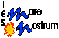

<br>
<br>

# Unidad 4. Formularios y Navegación

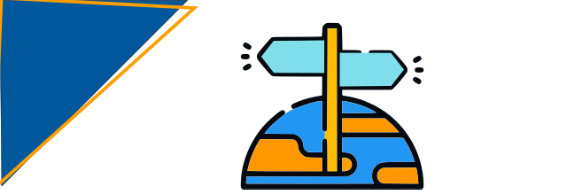

En la unidad anterior vimos cómo organizar las interfaces de usuario mediante widgets en pantallas. 

**En esta unidad** vamos a abordar los dos aspectos que quedan con el fin de implementar interfaces en una aplicación informática: Los **formularios** y la **navegación**.

La librería **Material** nos ofrece varios widgets con el fin de recoger la interacción y la entrada de datos por parte del usuario. Veremos cuáles son estos, y cómo Flutter hace uso de widgets con estado (`Stateful` con el fin de mantener su estado).

En la segunda parte de la unidad veremos el widget `Navigator`, que será el encargado de facilitar la navegación entre las diferentes pantallas de la aplicación.

[*1. Formularios. Widgets para formularios*](#_apartado1)

[*2. Trabajando con formularios*](#_apartado2)

[*3. Navegación*](#_apartado3)

[*4. Widgets de navegación*](#_apartado4)

[*5. Diálogos*](#_apartado5)

<br>
<br>

# <a name="_apartado1"></a> 1. Formularios. Widgets para formularios

## Introducción
La librería Material nos ofrece varios widgets con el fin de recoger la interacción y la entrada de datos por parte del usuario. 

Estos widgets por ellos mismos no tendrán la capacidad de mantener la información introducida por el usuario, de manera que deberemos hacer uso de widgets de tipo *Stateful* para mantener su estado.

Por otro lado, al tratarse de widgets de la librería Material, deben tener un antecesor de tipo Material (generalmente el propio *Scaffold*) en el árbol de widgets, dentro de una aplicación Material. 

A continuación, vamos a ver algunos de estos widgets y sus principales propiedades, y se os proporcionarán referencias a la documentación oficial de Flutter para cada widget, donde podéis encontrar su descripción completa, más ejemplos y vídeos.

## El widget TextField

Para capturar la entrada de texto del usuario podemos hacer uso de una caja de texto mediante el widget `TextField`. 

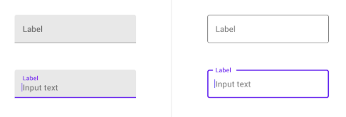

Algunas de las **propiedades** más interesantes de este widget son:

- `bool autofocus`: Para poner el foco de la aplicación sobre este widget,
  
- `int? maxLength`: Nos permite establecer el número máximo de caracteres.
  
- `TextInputType? keyboardType`: Establece el tipo de teclado en función de la información a introducir. Para ello hace uso de la clase TextInputType, con valores como TextInputType.datetime, TextInputType.emailAddress, TextInputType.multiline, TextInputType.name, TextInputType.number o TextInputType.phone.
  
- `InputDecoration? decoration` Permite establecer una decoración para la caja que rodea el widget.
  
- `bool obscureText`: Se trata de un valor booleano con el fin de ocultar los caracteres que escribimos, en campos que puedan contener información sensible, como un *password*.
  
- `String osbcuringCharanter`: Nos permite modificar el carácter a utilizar para ocultar campos sensibles.
  
- `void Function(String)? onChanged`: Se trata de una propiedad que contiene una función de *callback* que se dispara cuando el valor del texto cambia.
  
- `TextEditingController?` nos permite controlar el texto contenido en el TextView.

### Sobre el atributo decoration

El atributo `decoration` nos permite especificar mediante un widget de tipo `inputDecoration` el aspecto de la caja que rodea el campo de texto. Algunos de los aspectos que podemos modificar son:

- `hintText`: Un texto de ayuda que se mostrará como valor cuando todavía no hemos introducido nada.
  
- `labelText`: Un texto descriptivo que acompaña al TextInput.
  
- `Widget? label`: Sirve para añadir un texto como etiqueta. Esta propiedad no es compatible con la etiqueta labelText.
  
- `Widget? icon`: Para añadir un icono antes del cuadro de texto.
  
- `Widget? prefixIcon`: Para añadir un icono al inicio del cuadro de texto, pero dentro del mismo.
  
- `Widget? suffixIcon`: Para añadir un icono al final del cuadro de texto.
  
- `counterText`: Indica un texto que aparece en lugar del contador de caracteres, en la parte de abajo y a la derecha de la caja de texto.
  
- `helperText`: Indica un texto que aparece en la parte de abajo y a la izquierda de la caja de texto.

Veamos algunas de estas propiedades en el siguiente ejemplo:

```dart
 TextField(
        keyboardType: TextInputType.text,
        maxLength: 4,
        obscureText: true,
        obscuringCharacter: "?",
        //readOnly: true,
        decoration: InputDecoration(
            border: OutlineInputBorder(
              borderRadius: BorderRadius.circular(20),
            ),
            icon: const Icon(Icons.access_alarms_outlined),
            hintText: 'Esto es un hintText',
            labelText: 'Este es el labelText',
            suffixIcon: const Icon(Icons.people),
            prefixIcon: const Icon(Icons.email_rounded),
            prefix: const Text("Prefix/"),
            suffix: const Text("/Suffix"),
            helperText: "Este es el HelperText"
            ),
      )
```

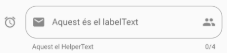

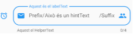

<br>

### **Accediendo al valor del TextField**

Si queremos acceder al valor del campo de texto, debemos hacerlo a través del evento `onChanged`, que se dispara cuando se modifica su contenido.

Un sencillo ejemplo, para mostrar el resultado por la terminal sería:

```dart
TextField(
    onChanged: (text) {
        debugPrint("Texto instroducido: " + text);
    },
)
```

Como vemos, este evento recibe un *String* con el contenido del `TextField`.

Si lo que queremos es que este valor pueda ser accesible desde otro lugar del mismo widget, habría que trabajar ya con widgets con estado, de manera que mantuviéramos en el mismo estado el valor de este texto y lo pudiéramos consultar desde otro lugar.

Vemos cómo hacerlo en el siguiente ejemplo, donde se recoge el valor introducido en el TextField y se muestra en un Texto:

```dart
import 'package:flutter/material.dart';

// En primer lugar, definimos el widget como un widget con estado
class EjemploForms2 extends StatefulWidget {
  const EjemploForms2({super.key});

  // Sobreescrimbimos el método createState() para crear el estado  @override
  State<EjemploForms2> createState() => _EjemploForms2State();
}

// Clase para el estado
class _EjemploForms2State extends State<EjemploForms2> {
  // Definimos el contenido como propiedad
  String? contenido;

  @override
  void initState() {
    super.initState();
    // Inicializamos el contenido
    contenido = "";
  }

  // Construimos el widget
  @override
  Widget build(BuildContext context) {
    return Center(
      child: Column(mainAxisAlignment: MainAxisAlignment.center, children: [
        TextField(
          decoration: InputDecoration(
            border: OutlineInputBorder(
              borderRadius: BorderRadius.circular(10),
            ),
          ),
          onChanged: (text) {
            // Cuando cambie el contenido, actualizaremos
            // la propiedad correspondiente de el estado y 
            // lo notificaremos con setStat
            setState(() {
              contenido = text;
            });
          },
        ),
        const Divider(),
        // Añadimos un segundo widget de tipo texto que 
        // muestra el contenido
        Text("$contenido"),
      ]),
    );
  }
}

```

En *el siguiente gist* podéis encontrar este código funcionando: 
[https://dartpad.dev/embed-flutter.html?id=b2d92eaf6e3fd76d9f1ad7a43dd73524](https://dartpad.dev/embed-flutter.html?id=b2d92eaf6e3fd76d9f1ad7a43dd73524)

<div style="overflow-x: auto; width: 100%;">
  <iframe
    src="https://dartpad.dev/embed-inline.html?id=b2d92eaf6e3fd76d9f1ad7a43dd73524"
    width="100%"
    height="500px"
    loading="lazy"
    frameborder="0">
  </iframe>
</div>

<br>

### **TextEditingController**

En el ejemplo anterior hemos visto cómo acceder al contenido de un `TextField` cuando se producen cambios en el mismo, pero no hemos visto cómo acceder directamente a su contenido, bien sea para consultarlo o para establecer, por ejemplo, un valor inicial.

Para ello, necesitamos asociar al widget un objeto de la clase `TextEditingController`, dentro de la propiedad `controller`, a través del cual podremos acceder a su propiedad texto.

Cuando un `TextField` que tiene asociado un `TextEditingController` es actualizado por el usuario, la propiedad `text` del controlador se modifica al valor introducido por el usuario, y el propio controlador será quien notifique sus propios *listeners*. Estos *listeners* podrán ahora acceder a las propiedades `text` y `selection` actualizadas. Del mismo modo, cuando actualicemos por código estas propiedades, el contenido del TextField también se modificará.

Vemos cómo hacerlo en el siguiente ejemplo:

```dart

// En primer lugar, definimos el widget como un widget con estado
class EjemploFormTextEditController extends StatefulWidget {
  const EjemploFormTextEditController({super.key});

  // Sobreescrimbimos el método createState() para crear el estado  @override
  @override
  State<EjemploFormTextEditController> createState() =>
      _EjemploFormTextEditControllerState();
}

// Definimos la clase correspondiente a el estado

class _EjemploFormTextEditControllerState
    extends State<EjemploFormTextEditController> {      
  // El estaod contiene un TextEditController, que
  // asociaremos al TextEdit
  final TextEditingController controlador = TextEditingController();

  @override
  void initState() {
    super.initState();
    // En el método initState del ciclo de vida del estado
    // podemos dar un valor inicial a la propiedad
    // text del controlador.
    controlador.text = "ValorInicial";
  }

  // Construimos el widget que estará compuesto por
  // un TextField, un Divider y un botón.
  // Tanto el TextField como el botón, se crean en
  // métodos aparte (creaTextField() i 
  // creaBotonSubmit()) para facilitar la legibilidad.

  @override
  Widget build(BuildContext context) {
    return Center(
      child: Column(
        mainAxisAlignment: MainAxisAlignment.center,
        children: [
          creaTextField(), 
          const Divider(),
          creaBotonSubmit(),
        ],
      ),
    );
  }

  @override
  void dispose() {
    // Liberamos el controlador cuando el widget
    // se elimina del árbol de widgets
    controlador.dispose();
    super.dispose();
  }

  TextField creaTextField() {
    return TextField(
      // Asociamos el controlador al controller
      // del TextField

      controller: controlador,
      decoration: InputDecoration(
        border: OutlineInputBorder(
          borderRadius: BorderRadius.circular(10),
        ),
      ),
    );
  }

  // Esta función devolverá un ElevatedButton,
  // cuya función será únicamente mostrar
  // un texto por consola cuando hacemos click en el mismo.
  ElevatedButton creaBotonSubmit() {
    return ElevatedButton(
      onPressed: () {
        debugPrint(controlador.text);
      },
      child: const Text("Enviar formualario"),
    );
  }
}
```
En *el siguiente gist* podéis encontrar este código funcionando: 
[https://dartpad.dev/embed-flutter.html?id=792d2c8f3966077da10240c9fa9acd48](https://dartpad.dev/embed-flutter.html?id=792d2c8f3966077da10240c9fa9acd48)

<div style="overflow-x: auto; width: 100%;">
  <iframe
    src="https://dartpad.dev/embed-inline.html?id=792d2c8f3966077da10240c9fa9acd48"
    width="100%"
    height="500px"
    loading="lazy"
    frameborder="0">
  </iframe>
</div>

Tened en cuenta que para ver el mensaje que se muestra por consola tenéis que abrir ésta en el Visual Studio Code.

<br>

## Los Widgets DropDownButton y DropDownMenuItem

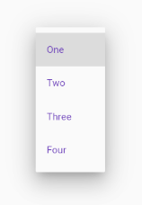

El *DropDownButton* es un widget de las especificaciones de Material Design, y consiste en un botón desplegable que permite al usuario realizar una selección de entre una lista de elementos. También se conoce como *spinner* o *combobox*. El botón mostrará el elemento seleccionado actualmente y una flecha que indica que podemos desplegar el menú para seleccionar otro elemento.

Este widget necesita un tipo genérico, que será el tipo de valor (*value*) que representa cada elemento desplegable, y éste debe ser coherente a todas las posibles opciones del desplegable. Habitualmente se usan valores enteros, generalmente enumeraciones.

Los parámetros más importantes del constructor son:

- `required List<DropDownMenuItem<T>> children`: Con la lista de elementos de tipo *DropDownMenuItem* parametrizada a un tipo *T*, que será el tipo genérico al que corresponderá el `value`. Los diferentes *DropDownMenuItems* necesitarán dos parámetros para construirse: un `child` con el widget que queremos visualizar, y un `value` con el valor 
  
- `required void Function(<T>) onChanged`: Que especifica el callback que se disparará cuando cambie la selección del usuario.
  
- `<T> value`: Con el valor asociado al elemento de la lista.

Veámoslo con un ejemplo sencillo:

```dart
DropdownButton(
  value: 1,
  onChanged: (int? valor) {
    debugPrint("Valor Escogido: $valor");
  },
  items: const [
    DropdownMenuItem(
      value: 1,
      child: Text('Elemento 1'),
    ),
    DropdownMenuItem(
      value: 2,
      child: Text('Elenento 2'),
    ),
    DropdownMenuItem(
      value: 3,
      child: Text('Elemento 3'),
    ),
  ],
)
```

Como vemos, estamos definiendo un botón que mostrará tres opciones: *"Elemento 1"*, *"Elemento 2"* y *"Elemento 3"*. Estas opciones tendrán los valores 1, 2 y 3 respectivamente, de manera que el tipo genérico que se utilizará será un `int`. El valor seleccionado de manera predeterminada será el primero y cuando el usuario cambie la selección y se dispare el evento `onChanged`, se mostrará por la terminal un mensaje con la opción seleccionada.

Hay que tener en cuenta que cuando el usuario cambie la selección, en este ejemplo sólo se mostrará por la terminal el valor seleccionado, pero no se actualizará la interfaz.

Para actualizar la interfaz, deberemos:

1. Definir el widget donde se ubica el botón como un widget con estado,
2. Guardarnos en el estado del widget la opción seleccionada. En caso de querer darle un valor inicial, podemos hacerlo en `initState()`.
3. Enlazar la propiedad `value` del widget con el valor del estado.
4. Hacer uso del método `setState()` cuando se modifique la opción y, por lo tanto, cambie el value, con el fin de redibujar el widget con la nueva selección.

Así pues, la clase quedaría de la siguiente manera:

```dart
// Definimos la clase para el botón como un widget con estado
class MyDropdownButton extends StatefulWidget {
  const MyDropdownButton({
    Key? key,
  }) : super(key: key);


  @override // Creación del estado asociado
  State<MyDropdownButton> createState() => _MyDropdownButtonState();
}

// Definimos la clase que representa el estado
class _MyDropdownButtonState extends State<MyDropdownButton> {
  // Incorporamos el valor de la selección como estado del widget
  int? valorSeleccionado;

  @override
  void initState() {   // Damos valor inicial
    super.initState();
    valorSeleccionado = 1;
  }

  @override // Construcción del widget
  Widget build(BuildContext context) {
    return DropdownButton(
      value: valorSeleccionado, // Asociamos value al valor seleccionado
      onChanged: (int? valor) {
        debugPrint("Valor Elegido: $valor");
        setState(() {
          // Cuando se cambia la selección actualizamos el estado
          valorSeleccionado = valor ?? 1;
        });
      },
      // Los items de la lista serán elementos de tipo Text
      // asociados a un valor entero
      items: const [
        DropdownMenuItem(
          value: 1,
          child: Text('Elemento 1'),
        ),
        DropdownMenuItem(
          value: 2,
          child: Text('Elenento 2'),
        ),
        DropdownMenuItem(
          value: 3,
          child: Text('Elemento 3'),
        ),
      ],
    );
  }
}
```

En *el siguiente gist* podéis encontrar este código funcionando: 
[https://dartpad.dev/embed-flutter.html?id=a220026119048ef7803a5c8ab10454ab](https://dartpad.dev/embed-flutter.html?id=a220026119048ef7803a5c8ab10454ab)

<div style="overflow-x: auto; width: 100%;">
  <iframe
    src="https://dartpad.dev/embed-inline.html?id=a220026119048ef7803a5c8ab10454ab"
    width="100%"
    height="500px"
    loading="lazy"
    frameborder="0">
  </iframe>
</div>

El **tipo de datos** que usamos tanto para el `value` del DropdownButton, como para el `value` del DropdownMenuItem, como para el valor que guardaremos en el estado (`valorSeleccionado` en el ejemplo), así como para el tipo de datos que recibimos en el `onChanged` debe ser el mismo.

Tengamos en cuenta  que la lista de opciones no tiene por qué ser una lista de elementos estática, sino que la podemos obtener también desde una estructura dinámica. Vemos en el siguiente ejemplo cómo añadiríamos una lista al estado y cómo crearíamos esta lista de opciones. Además, vamos ahora a utilizar valores de tipo *String* en lugar de enteros.

```dart
// Definimos la clase para el botón como un widget con estado
class MyDropdownButton extends StatefulWidget {
  const MyDropdownButton({
    Key? key,
  }) : super(key: key);

  @override
  State<MyDropdownButton> createState() => _MyDropdownButtonState();
}

// Definimos la clase que representa el estado
class _MyDropdownButtonState extends State<MyDropdownButton> {
  // Incorporamos la lista de opciones al estado del widget
  // La declaramos late porque le daremos valor posteriormente
  late List<String> listaOpciones;

  // Incorporem també a l'estat el valor seleccionat
  String? valorSeleccionado;

  @override
  void initState() {
    // Damos valores iniciales
    super.initState();
    valorSeleccionado = "Opcion 1";
    listaOpciones = ["Opcion 1", "Opcion 2", "Opcion 3"];
  }

  @override
  Widget build(BuildContext context) {
    // Construcción del widget
    return DropdownButton(
        // Asociamos la propiedad value con el valor seleccionado
        value: valorSeleccionado,
        // Asociamos el callback en el evento onChange
        // Ahora el valor es String, no int
        onChanged: (String? valor) {   
          debugPrint("Valor Escogido: $valor");
          setState(() {
            valorSeleccionado = valor ?? "Opcion 1";
          });
        },
        // Para la lista de items hacemos una función aparte
        items: _creaListaItems());
  }

  // Generación de la lista de DropdownMenuItems a partir
  // de la lista de elementos
  List<DropdownMenuItem<String>> _creaListaItems() {
    List<DropdownMenuItem<String>> lista = [];
    for (var element in listaOpciones) {
      lista.add(DropdownMenuItem(
        value: element,
        child: Text(element),
      ));
    }

    return lista;
  }
}
```

En *el siguiente gist* podéis encontrar este código funcionando: 
[https://dartpad.dev/embed-flutter.html?id=b8ea5457046bd348f41c33c6aaa5b5fa](https://dartpad.dev/embed-flutter.html?id=b8ea5457046bd348f41c33c6aaa5b5fa)

<div style="overflow-x: auto; width: 100%;">
  <iframe
    src="https://dartpad.dev/embed-inline.html?id=b8ea5457046bd348f41c33c6aaa5b5fa"
    width="100%"
    height="500px"
    loading="lazy"
    frameborder="0">
  </iframe>
</div>

[Referència a la classe DropdownButton](https://api.flutter.dev/flutter/material/DropdownButton-class.html)

<br>

---
### Actividad Voluntaria

Crea un widget con estado que contenga los tres elementos siguientes organizados en forma de columna:

- Un *`DropdownButton`*, con una lista de tres elementos.
- Una división *`Divider()`*
- Un *`TextField`*.

El comportamiento será el siguiente:

El usuario puede escribir lo que desee sobre el *`TextField`*, y cuando pulse la tecla *Enter* (se lanza el evento onSubmit), deberá:

- Añadir una nueva opción al *DropDownButton* con el valor del TextField.
- Dejar esta última opción añadida como seleccionada.
- Borrar el contenido del TextField.
  
---

<br>

## Los widgets Checkbox y CheckboxListTile

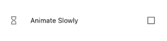

Los widgets `Checkbox` y `CheckboxListTile` representan una casilla de selección típica de *Material Design*. El widget `Checkbox` representa una casilla aislada, mientras que el widget `CheckboxListTile`, además, acompaña esta casilla de selección con determinado contenido, generalmente un texto.

Estas clases, por sí mismas no representarán visualmente su estado, sino que deberemos ser nosotros quienes proporcionemos esta funcionalidad. Para ello, cuando el usuario hace clic en la casilla provoca que se dispare el evento `onChanged()`, proporcionando el estado de la selección. El callback que gestione este evento será pues quien reconstruya el *checkbox* con el nuevo valor.


Las casillas de selección pueden llegar a contener hasta tres estados. Aparte de *cierto* y *falso*, su valor también puede ser ***null*** si definimos la propiedad `tristate` a `true`. En este caso, cuando el valor del *Checkbox* sea nulo, se muestra un guión.

Al igual que el resto de componentes definidos en Material, requiere que alguno de sus padres sea un widget de tipo Material.

El constructor del `Checkbox` tiene varios parámetros, entre los que podemos destacar:

- `required bool? value`: con el valor que contendrá el Checkbox (*true*, *false* o *null*). Lo que haremos será utilizar una propiedad en el estado del widget que mantenga este valor.
  
- `required void Function(bool?)? onChanged`: Define el *callback* que se dispara cuando el usuario hace click para cambiar la selección del botón.
  
- `{bool tristate = false}`: Indica si el *Checkbox* admitirá también como valor null o no.
  
- `{Widget? title}`: Para los guiños de tipo `CheckboxListTile` contiene un widget que será el que acompañe, a modo de título en la casilla. Generalmente, contendrá un `Text`, pero puede contener cualquier elemento.

Veamos un ejemplo de uso:

```dart
class MyCheckbox extends StatefulWidget {
  const MyCheckbox({super.key});

  @override
  State<MyCheckbox> createState() => _MyCheckboxState();
}

// Definimos el estado asociado a la clase
class _MyCheckboxState extends State<MyCheckbox> {
  // Definimos la propiedad isChecked en el estado
  bool? isChecked;

  @override
  void initState() {
    // Inicializamos la propiedad isChecked
    super.initState();
    isChecked = false;
  }

  @override
  Widget build(BuildContext context) {
    return CheckboxListTile(
      // Asociamos el callback en el evento onChanged
      onChanged: (val) {
        // Actualizamos el estado con el valor proporcionado
        setState(() {
          isChecked = val;
        });
      },
      tristate: true, // Inidicamos que puede contener null
      // Enlazamos el valor con la propiedad isChecked del estado
      value: isChecked,
      // Establecemos el contenido para el título
      title: const Text("Texto para el checkbox"),
    );
  }
}
```

En *el siguiente gist* podéis encontrar este código funcionando: 
[https://dartpad.dev/embed-flutter.html?id=9256717e898d633d67dc990d3838593b](https://dartpad.dev/embed-flutter.html?id=9256717e898d633d67dc990d3838593b)

<div style="overflow-x: auto; width: 100%;">
  <iframe
    src="https://dartpad.dev/embed-inline.html?id=9256717e898d633d67dc990d3838593b"
    width="100%"
    height="500px"
    loading="lazy"
    frameborder="0">
  </iframe>
</div>

- [La classe Checkbox](https://api.flutter.dev/flutter/material/Checkbox-class.html)
- [La classe CheckboxListTile](https://api.flutter.dev/flutter/material/CheckboxListTile-class.html)

<br>

## Los widgets Switch y SwitchListTile
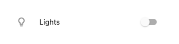

Los *switch* (*interruptores*) son otro de los componentes introducidos por Material Design, y que sirven para activar o desactivar el estado de un elemento, de manera muy parecida a un Checkbox. Al igual que éste, el *switch* tampoco mantiene el estado por sí mismo, sino que dispara el evento `onChanged` cuando el usuario interactúa con él. Para mantener su estado, deberemos capturar este evento y reconstruir el widget con el nuevo aspecto.

También, al tratarse de un widget de Material, requiere descender en el árbol de widgets de un widget de este tipo.

Las propiedades más relevantes del Switch son:

- `value`: De tipo bool, contiene el valor activado/desactivado del widget. Es un parámetro obligatorio al constructor.
  
- `onChanged`: Se trata de la función de callback que se dispara cuando el usuario interactúa con el Switch. Esta función recibirá un valor lógico con el estado del widget.

Hay que tener en cuenta que no tiene el mismo efecto asociar una función vacía al evento `onChanged` que asociarle un valor *nulo*. En el primer caso, el widget estará activo, aunque no cambiará de estado cuando hagamos *clic* en él, mientras que en el segundo, el componente estará inhabilitado.

Por su parte, el widget `SwitchListTile` sería para el Switch lo que el `CheckBoxListTile` es para el `Checkbox` Es decir, un Switch con un widget (generalmente un texto) asociado. Además de las propiedades `value` y `onChanged` este widget, entre otros, admite:

- `title`: Un widget que sirve como título para el switch y que se ubica a la izquierda del interruptor. En este caso, el widget ocupará todo el ancho disponible del contenedor padre.
  
- `subtitle`: Un widget que sirve de subtítulo, y que se ubica centrado y en la parte inferior.

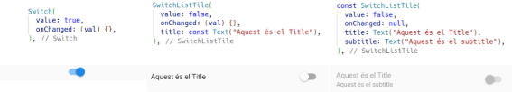

Si deseamos gestionar el estado del componente, será necesario que creamos un wiget con estado personalizado y lo actualicemos siempre que se interactúe con él, al igual que hacemos en el *CheckBox*. El código para ello será:

```dart
// 1. Definimos el widget con estado
class MySwitch extends StatefulWidget {
  const MySwitch({
    Key? key,
  }) : super(key: key);

  @override
  State<MySwitch> createState() => _MySwitchState();
}


// 2. Definimos la clase estado con el valor del
//    switch como propiedad.

class _MySwitchState extends State<MySwitch> {
  bool? valor;

  // 3. Inicializamos el valor del switch
  @override
  void initState() {
    super.initState();
    valor = false;
  }

  @override
  Widget build(BuildContext context) {
    return SwitchListTile(
      value: valor ?? false,
      onChanged: (val) {
        // 4. Cuando se produce un cambio de estado
        //    Volvemos a dibujar el widget cambiando 
        //    la propiedad valor.
        setState(() {
          valor = val;
        });
      },
      title: const Text("Este es el Título"),
    );
  }
}
```

En *el siguiente gist* podéis encontrar este código funcionando: 
[https://dartpad.dev/embed-flutter.html?id=c2fd1aff0e23e49daba43e058baa67f7](https://dartpad.dev/embed-flutter.html?id=c2fd1aff0e23e49daba43e058baa67f7)

<div style="overflow-x: auto; width: 100%;">
  <iframe
    src="https://dartpad.dev/embed-inline.html?id=c2fd1aff0e23e49daba43e058baa67f7"
    width="100%"
    height="500px"
    loading="lazy"
    frameborder="0">
  </iframe>
</div>


- [Referència de la classe Switch](https://api.flutter.dev/flutter/material/Switch-class.html)
- [Referència de la classe SwitchListTile](https://api.flutter.dev/flutter/material/SwitchListTile-class.html)

<br>

## Los widgets Radio y RadioListTile

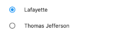

Los widgets `Radio` y `RadioListTile` son botones de opciones utilizados para realizar una selección de entre una serie de valores excluyentes entre ellos, de manera que cuando se selecciona un botón de opción de un grupo, el resto de botones dejan de estar seleccionados.

Estas clases deben estar parametrizadas por un tipo genérico, que generalmente será un enumerado.

Como los widgets vistos anteriormente, también dependen de un antecesor de tipo Material, y tampoco mantienen el estado, por lo que debemos gestionarlos nosotros.

Las propiedades obligatorias para estos tipos de widget son:

- `value`: El valor asociado al botón en sí, y será del tipo genérico del mismo.
  
- `groupValue`: El valor seleccionado actualmente en un grupo de botones de opciones. 
  
- `onChanged`: El callback que se llama cuando se selecciona un botón.

El widget `Radio`, por sí mismo no tiene ningún texto asociado, por lo que si queremos utilizarlo habría que crear otro widget donde el `Radio` estuviera acompañado por algún `Text`, como un `Row` o un `Column`. 

En cambio, el guiño `RadioListTile` sí nos permite acompañar el botón de un texto, por lo que nos resultará más sencillo de utilizar. Este widget tendrá pues las siguientes propiedades:

- `title`: Con el widget (generalmente un `Text`) que hará de texto principal
- `subtitle`: Con el widget (generalmente un `Text`) que hará de texto secundario.

Vemos un ejemplo completo haciendo un conjunto de dos botones de tipo `RadioListTile`:

```dart
// 1. Definimos los enumerados que utilizaremos como valores.
enum ValoresEnumerados { enumerado1, enumerado2 }

// 2. Definimos el widget
class MyRadioWidget extends StatefulWidget {
  const MyRadioWidget({super.key});

  @override
  State<MyRadioWidget> createState() => _MyRadioWidgetState();
}

// 3. Definimos el estado asociado al widget

class _MyRadioWidgetState extends State<MyRadioWidget> {
  // 3.1. Añadimos al estado una propiedad de tipo valoresEnumerados
  ValoresEnumerados? _valor;

  @override
  void initState() {
    // 3.2. Inicializamos la propiedad
    super.initState();
    _valor = ValoresEnumerados.enumerado1;
  }

  // 3.3. Construcción del widget
  @override
  Widget build(BuildContext context) {
    return Column(
      // Organizamos los diferentes Radio Buttons en forma de columna
      children: [
        RadioListTile(
          // Texto principal
          title: const Text("Texto para la primera opción"),
          // Text secundario
          subtitle: Text("El valor asociado es: ${ValoresEnumerados.enumerado1}"),
          // Definimos el grupo donde se encontrará este Radio, que coincidirà          
          // con la propiedad _valor que hemos definido en el estado.
          groupValue: _valor,
          onChanged: (ValoresEnumerados? valor) {
            // Cuando se cambie la selección, se actualizará el estado
            // Si el valor seleccionado coincide con el groupValue,
            // este widget se seleccionarà, y se eliminará de la selección
            // de los otros Radios con el mismo groupValue
            setState(() {
              _valor = valor;
            });
          },
          value: ValoresEnumerados.enumerado1,
        ),
        // Segon botó de ràdio, amb el comportament semblant a l'anterior
        RadioListTile(
          title: const Text("Text per a la segona opció"),
          subtitle: Text("El valor associat és: ${ValoresEnumerados.enumerado2}"),
          groupValue: _valor,
          onChanged: (ValoresEnumerados? valor) {
            setState(() {
              _valor = valor;
            });
          },
          value: ValoresEnumerados.enumerado2,
        ),
      ],
    );
  }
}
```

La clave para gestionar este tipo de widgets se encuentra en la propiedad privada `_value` que es la que define el estado del widget, así como en las propiedades `value` y `groupValue` de cada `Radio`. La primera (`value`) define el valor predeterminado para cada opción, mientras que la segunda (`groupValue`) define **para el mismo grupo de botones** qué valor está seleccionado. Como asociamos con los botones al valor `_valor` definido en el estado, ambos botones estarán en el mismo grupo.

En *el siguiente gist* podéis encontrar este código funcionando: 
[https://dartpad.dev/embed-flutter.html?id=0143d202d9fdabb65acb8c933916a9a5](https://dartpad.dev/embed-flutter.html?id=0143d202d9fdabb65acb8c933916a9a5)

<div style="overflow-x: auto; width: 100%;">
  <iframe
    src="https://dartpad.dev/embed-inline.html?id=0143d202d9fdabb65acb8c933916a9a5"
    width="100%"
    height="500px"
    loading="lazy"
    frameborder="0">
  </iframe>
</div>

- [La classe Radio](https://api.flutter.dev/flutter/material/Radio-class.html)
- [La classe RadioListTile](https://api.flutter.dev/flutter/material/RadioListTile-class.html)

<br>

## El widget Slider

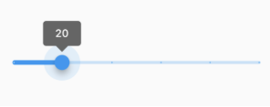

Este componente de Material consiste en una barra de desplazamiento utilizada con el fin de escoger un valor en un rango de valores posibles.

Las propiedades **obligatorias** para el constructor serán:

- `value`: Contendrá el valor actual del Slider.
  
- `onChanged` Define el método que se invocará cuando se produce un cambio en la barra de desplazamiento.

Otras propiedades que podremos establecer en el constructor, entre otras son:

- `min`: El valor mínimo que se puede seleccionar. Si no se especifica nada, este valor será 0.0.
  
- `max`: El valor máximo que se puede seleccionar. Si no se especifica, el valor másimo será 1.0.
  
- `divisions`: El número de divisiones *discretas* que tiene el Slider. Si no se indica nada, podrá tomar cualquier valor entre el mínimo y el máximo definidos. El valor que nos devolverá siempre el Slider será con decimales, por lo que, si queremos valores enteros habrá que hacer una conversión.
  
- `label`: El texto que se muestra al lado del widget cuando cambia de valor.

Como el resto de elementos vistos en este apartado, la gestión del estado del giny la tendremos que hacer nosotros.

Veámoslo con un ejemplo:

```dart
class MySlider extends StatefulWidget {
  const MySlider({
    Key? key,
  }) : super(key: key);

  @override
  State<MySlider> createState() => _MySliderState();
}

class _MySliderState extends State<MySlider> {
  double? _valor;
  @override
  void initState() {
    super.initState();
    _valor = 100;
  }

  @override
  Widget build(BuildContext context) {
    return Slider(
      divisions: 5,
      min: 100,
      max: 1000,
      label: _valor.toString(),
      onChanged: (double val) {
        setState(() {
          _valor = val;
        });
      },
      value: _valor ?? 0.0,
    );
  }
}
```

En *el siguiente gist* podéis encontrar este código funcionando: 
[https://dartpad.dev/embed-flutter.html?id=063baba175f67f9037e43e2e7849c59d](https://dartpad.dev/embed-flutter.html?id=063baba175f67f9037e43e2e7849c59d)

<div style="overflow-x: auto; width: 100%;">
  <iframe
    src="https://dartpad.dev/embed-inline.html?id=063baba175f67f9037e43e2e7849c59d"
    width="100%"
    height="500px"
    loading="lazy"
    frameborder="0">
  </iframe>
</div>

[**La clase Slider**](https://api.flutter.dev/flutter/material/Slider-class.html)

---
### Ejercicio voluntario

Crea un selector de color mediante sus componentes de rojo, verde y azul. Para ello utiliza un contenedor de 500x500, que muestre el color resultante, y tres Sliders, con valores posibles  del 0 al 255, y que nos permitan seleccionar la cantidad de rojo, verde y azul del color del contenedor.
<hr>

<br>
<br>
<br>

# <a name="_apartado2"></a>2. Trabajando con formularios

## Formularios con validaciones

A menudo, cuando trabajamos con formularios necesitamos realizar validaciones o acceder desde un componente del formulario a otro. Para ello necesitaremos indicar de alguna manera **qué widgets pertenecen al mismo formulario**, y por lo tanto, tienen acceso al resto de widgets del mismo.

El widget `Form` es un contenedor pensado expresamente para esta finalidad: agrupar diversos widgets y, además, posibilitar las validaciones sobre determinados campos. Para ello, cada widget individual debe rodearse de un widget de tipo `FormField` que aporta diversas funcionalidades al widget como las validaciones y actualizaciones del formulario.

Ahí es donde vamos a hacer uso, por primera vez de **las claves de los widgets**. Con ellas podremos identificar el formulario con el que estamos trabajando y hacer posibles las validaciones posteriormente.

En el cookbook [*Build a form with validation*](https://docs.flutter.dev/cookbook/forms/validation) de la documentación oficial de Flutter se nos presenta el proceso general para realizar validaciones en un formulario.

En general, y tal y como se comenta en la documentación, el procedimiento a seguir será:

1. Crear un widget con estado personalizado, cuyo estado contenga una clave global (*GlobalKey*) con el que identificar el formulario. El método build del estado devolverá un widget de tipo Form con el formulario.
   
2. Dentro del `Form`, añadiremos tantos widgets de tipo `FormField` como necesitemos, con la lógica de validación de cada uno.
   
3. Añadir un botón para la validación y procesado del formulario.

La clase `GlobalKey` es una subclase de `Key`, con la peculiaridad de que no sólo permite su acceso desde la propia jerarquía en el árbol de widgets, sino que lo permite desde cualquier lugar de la aplicación.

Veámoslo con un poco de código en el siguiente ejemplo.

### **Paso 1. Creación del widget con estado personalizado.**

En primer lugar, creamos un **StatefulWidget**. Podemos hacerlo a partir del ***snippet*** correspondiente, que nos genera tanto la clase para el widget como la clase para su estado. Es en esta clase donde deberemos definir una propiedad de tipo `GlobalKey`, para la clave, de manera que con ella se pueda identificar éste dentro del árbol de widgets. Esta clave será de tipo `GlobalKey` y estará parametrizada en la clase `FormState` (estado asociado a un formulario).

```dart
// Widget con estado para el formulario
class FormularioPersonalizado extends StatefulWidget {
  const FormularioPersonalizado({super.key});

  @override
  FormularioPersonalizadoState createState() {
    return FormularioPersonalizadoState();
  }
}

// Estado del formulario
class FormularioPersonalizadoState extends State<FormularioPersonalizado> {

  // Añadimos al estado la GlobalKey, que llamamos _formKey.
  final GlobalKey<FormState> _formKey = GlobalKey<FormState>();

  @override
  Widget build(BuildContext context) {
    return Form(...);
  }
}
```

### **Paso 2. Añadiendo widgets al formulario**
El método `build` del estado de nuestro widget devolverá un `Form` el cual requiere una propiedad `child` con el contenido. Dentro de este `child` podemos crear cualquier agrupación de widgets. Una opción habitual de organización, si se espera una cantidad considerable de elementos en el formulario es añadirlos dentro de un ListView, que ya ofrece la posibilidad de mostrar una barra de desplazamiento si el contenido sobrepasa los márgenes de la pantalla.

Cuando creamos el `Form`, le proporcionaremos la clave del formulario que hemos creado:

```dart
class FormularioPersonalizadoState extends State<FormularioPersonalizado> {

  final GlobalKey<FormState> _formKey = GlobalKey<FormState>();

  @override
  Widget build(BuildContext context) {
    return Form(
      // Añadimos como clave del formulario la clave _formKey que hemos generado      
      key: _formKey,
      // Organizamos los distintos widgets del formulario dentro de un ListView
      child: ListView(
        children: <Widget>[
           ... // Aquí van los diferentes widgets del formulario
        ],
      ),
    );
  }
}
```

Aquellos widgets que recogen la interacción del usuario deberán ir dentro de un **widget con estado** de tipo `FormField`. El constructor de este `FormField` requerirá de un parámetro `builder` consistente en una función para construir el widget en cuestión. 

Algunos de los parámetros que podemos proporcionarle al `FormField` en su construcción serán:

- `initialValue`, para especificar un valor inicial. En caso de que no se indique, será *nulo*.
- `validator`, con un método para validar la entrada. Recibirá como argumento el valor, y devolverá un texto con el mensaje de error a mostrar o *null* en caso contrario.

El método `builder`, además, recibirá un argumento de tipo `FormFieldState`, que contendrá el valor almacenado en el *FormField*. De esta manera, podremos construir el widget según este valor, y modificarlo en caso de que sea necesario (por ejemplo cuando el widget detecta el evento `onChanged`).

Vemos un ejemplo para crear un `FormField` que contenga un `CheckBox`, y nos permita darle un valor inicial y añadirle validación:

```dart
FormField(
    // Valor inicial a false
    initialValue: false,
    // Definimos las validaciones sobre el valor
    // En este caso queremos comprobar que se haya marcado el check.
    validator: (value) {
      // La primera "!" és para hacer la negación
      // La segunda "!" para  indicar que el valor no será null
      if (!value!) { 
        return 'Se debe marcar la casilla';
      }
      // Si llegamo saquí, el formulario es correcto
      // Esta línea sería opcional
      return null; 
    },

    // En la construcción del widget recibimos el argumento field
    // con el estado del FormField.
    builder: (FormFieldState<dynamic> field) {
      return Checkbox(
        // El valor del widget será el que tenga el FormField
        value: field.value,

        // Cuano se haga click en el chkecbox
        // se llama a onChanged, el cual deberá notificar al
        // formField que éste ha canviado de valor, haciendo uso
        // del método didChange.
        onChanged: (bool? value) {
          setState(() {
            field.didChange(value);
          });
        },
      );
    },
  );
```

Observe bien cómo se producen los cambios de estado en el ***FormField***: Cuando el `Checkbox` captura el evento `onChanged` recibe en este el nuevo valor del estado `(bool? value)`. Entonces, lo que hacemos es actualitar el estado invocando el método `didChange` del field, y proporcionándole a éste el nuevo valor (`SetState(){ field.didChange(value); }`). Este método actualizará el estado del campo con el valor que le proporcionamos. Por otro lado, observamos también cómo este valor del campo debe asignarse a la propiedad `value` del `Checkbox`, para que el widget refleje el estado.

Un caso particular de ***FormField*** es el widget ***TextFormField***. Este widget es equivalente a un ***TextField*** pero con propiedades características de un ***FormField***, como por ejemplo, el parámetro `validator` para realizar las validaciones.

Otra opción que suele usarse en lugar de rodear nuestro widget con el ***FormField*** es crear una nueva clase que sea una especialización del FormField, de manera que herede todas sus propiedades, y que defina adicionalmente el widget que queremos representar. De esta manera, podremos utilizar nuestro widget de manera similar a como utilizaríamos el TextFormField. Podéis leer el procedimiento en los artículos [Making en Custom FordField y Flutter](https://uncoded-decimal.medium.com/making-a-custom-formfield-in-flutter-135558c22f05) y [Creating Custom Form Fields in Flutter](https://medium.com/saugo360/creating-custom-form-fields-in-flutter-85a8f46c2f41).

### **Paso 3. Procesamiento del formulario**

Generalmente, haremos uso de un botón con el fin de validar y procesar la información del formulario. En caso de que los campos del mismo sean correctos se procesará el formulario, y en caso contrario, se marcarán los errores que se han cometido.

Aquí es donde entrará en juego la ***key*** asociada al ***Form***. Esta clave ofrece el método `currentState` para acceder al estado (objeto de la clase `FormState`) del formulario, que es generado de manera automática cuando se crea el formulario. 

La clase `FormState` dispone también de un método validado que lanzará las diferentes funciones `validator` para cada uno de los campos del formulario. Si todos los ***validators*** son correctos el método devolverá `true`, y se podrá procesar el formulario. En caso de que algún ***validador*** falle, se mostrará el mensaje de error para el campo en concreto y devolverá false.

Esquemáticamente, el código de un botón con este comportamiento sería el siguiente:

```dart
ElevatedButton(
  onPressed: () {
    if (_formKey.currentState?.validate() ?? false) {
      //  Este bloque únicamente se ejecutará en el caso que
      //  no haya errores en el formulario.
    }
  },
  child: const Text('Enviar'),
)
```
<br>

## Ejemplo completo

En el siguiente código dispone de un ejemplo completo, que simula un formulario de registro simplificado, con un campo de texto para recoger un correo electrónico y un ***checkbox*** para aceptar las condiciones del registro.

Las validaciones que se realizarán serán:

- Sobre el TextField: 
  - Comprobar que el contenido no está vacío
  - Comprobar que es un correo válido, mediante una expresión regular
- Sobre el checkbox:
  - Verificar que el usuario ha marcado la casilla para aceptar las condiciones del registro.

El código completo y comentado de esta aplicación sería el siguiente. 

```dart
// Creamos un widget con estado
class MyRegisterForm extends StatefulWidget {
  const MyRegisterForm({super.key});

  @override
  MyRegisterFormState createState() {
    return MyRegisterFormState();
  }
}

// Creamos una clase de tipo State
class MyRegisterFormState extends State<MyRegisterForm> {
  // Para esta clase vamos a crear una clave global, de tipo
  // FormState que nos sirva para identificar el widget en 
  // el árbol de widgets y por tanto poder validar el formulario.

  final GlobalKey<FormState> _formKey = GlobalKey<FormState>();
  final TextEditingController _controlador = TextEditingController();

  @override
  Widget build(BuildContext context) {
    return Form(
      // Añadimos como clave del formulario la clave _formKey que hemos generado
      key: _formKey,
      // Organizamos los diferentes widgets del formulario en un ListView
      child: ListView(
        padding: const EdgeInsets.all(16.0),
        children: <Widget>[
          // Para crear los distintos widgets hemos creado los tres métodos siguientes
          // de manera que aligeremos el código del método build:
          createRegisterNameFormField(),
          createCheckboxConditionsFormField(),
          createSubmitButton(context),
        ],
      ),
    );
  }

  @override
  void initState() {
    super.initState();
    // Inicializamos el texto del controlador
    _controlador.text = "";
  }

  @override
  void dispose() {
    // Liberamos el controlador cuando el widget se elimine
    _controlador.dispose();
    super.dispose();
  }

  TextFormField createRegisterNameFormField() {
    // Crea el widget de tipo TextFormField
    return TextFormField(
      // Definimos el controlador
      controller: _controlador,
      // Con la propiedad validator definimos las validaciones
      validator: (value) {
        if (value?.isEmpty ?? true) {
          return 'El nombre no puede estar vacío';
        }
        // Expresión regular para validar un correo electrónico
        final regexCorreu = RegExp(r'^[\w-\.]+@([\w-]+\.)+[\w-]{2,4}$');

        // Validación del correo con la expresión regular
        if (!regexCorreu.hasMatch(value ?? "")) {
          return 'La dirección de correo no es válida';
        }
        return null;
      },

      decoration: InputDecoration(
          border: OutlineInputBorder(
            borderRadius: BorderRadius.circular(10),
          ),
          icon: const Icon(Icons.email),
          labelText: "Dirección de correo",
      ),
    );
  }

  FormField<bool> createCheckboxConditionsFormField() {
    // Creamos un FormField para envolver al Checkbox
    return FormField(
      // Damos un valor inicial
      initialValue: false,
      // Definimos las validaciones sobre el valor
      validator: (value) {
        if (!value!) {
          return 'Ha de aceptar las condiciones';
        }
        return null;
      },
      // Constructor del widget. Recibimos en field 
      // el estado del FormField.
      builder: (FormFieldState<dynamic> field) {
        return CheckboxListTile(
          // El valor del widget será el que tenga el FormField
          value: field.value,
          title: const Text("He leído y acepto las condiciones"),
          // Utilizamos el subtítulo para indicar los mensajes de error
          subtitle: Text(
            field.errorText ?? "",
            style: TextStyle(
                fontStyle: FontStyle.normal,
                fontSize: 12,
                color: Colors.red[700],
                height: 0.5),
          ),
          // Cuando se haga click en el checkbox,
          // se llama a onChanged, que habrá de notificar al
          // formField que este ha cambiado de valor haciondo uso
          // del método didChange (sin necesidad de llamar a setState!)
          onChanged: (bool? value) {
            field.didChange(value);
          },
        );
      },
    );
  }

  // Botón para enviar el formulario previa validación
  Widget createSubmitButton(BuildContext context) {
    return Padding(
      padding: const EdgeInsets.symmetric(vertical: 16.0),
      child: ElevatedButton(
        onPressed: () {
          // Accedemos al formulario haciendo uso de _formKey.
          // Desde aquí accedemos al estado actual mediante currentState,
          // y lo validamos con el método "validate".
          // Este método llamará a todas las validaciones de cada widget.
          // Si todas son válidas, el formulario es válido.

          if (_formKey.currentState?.validate() ?? false) {
            // De momento, mostraremos un Snackbar para indicar
            // que el formulario es correcto.

            ScaffoldMessenger.of(context).showSnackBar(
              SnackBar(
                content: Text(
                    'Los datos se han procesado correctamente: ${_controlador.text}'),
              ),
            );
          }
        },
        child: const Text('Regístrate'),
      ),
    );
  }
}
```
En *el siguiente gist* podéis encontrar este código funcionando: 
[https://dartpad.dev/embed-flutter.html?id=7295ca31234ec8ec2141452868436365](https://dartpad.dev/embed-flutter.html?id=7295ca31234ec8ec2141452868436365)

<div style="overflow-x: auto; width: 100%;">
  <iframe
    src="https://dartpad.dev/embed-inline.html?id=7295ca31234ec8ec2141452868436365"
    width="100%"
    height="500px"
    loading="lazy"
    frameborder="0">
  </iframe>
</div>

<br>
<br>

# <a name="_apartado3"></a>3. Navegación

Las aplicaciones, tanto móviles como web y de escritorio, generalmente hacen uso de varias pantallas o vistas, entre las que podemos navegar y compartir información.

En Flutter, el componente encargado de facilitar esta navegación es el widget *Navigator*, que se ubica en la parte superior de la jerarquía de widgets y mantiene el historial, en forma de pila, de las diferentes pantallas que se han visitado. Estas pantallas serán widgets secundarios del Navigator.

A medida que el usuario navega por las diferentes pantallas de la aplicación, estas van superponiéndose unas sobre otras, de manera que en la parte superior de la pila tendremos la pantalla más reciente, y debajo, el resto de pantallas más antiguas. Cuando el usuario quiere volver a la pantalla anterior en el historial, lo que haremos es desapilar el elemento que se encuentra en la parte superior de la pila, de manera que quede visible la pantalla anterior. En cambio, si el usuario quiere volver a otra pantalla del historial, lo que se hace es reordenar el historial para subir esta pantalla a la parte superior de la pila.

## Rutas y rutas con nombre

En Flutter, las diferentes páginas o pantallas que componen nuestras aplicaciones y que permiten la navegación entre ellas suelen conocerse como **rutas**.

Con el fin de navegar entre diferentes rutas, podemos hacer uso del objeto Navigator y sus métodos **push** y **pop**, para apilar y desapilar rutas, o bien hacer uso de rutas con nombre.

### **Trabajando con rutas**

Con el fin de apilar una ruta a la pila administrada por el Navigator, y por lo tanto, abrir una nueva pantalla, hacemos uso del método `Navigator.push`, de la siguiente manera:

```dart
Navigator.push<void>(
    context,
    MaterialPageRoute<void>(
      builder: (BuildContext context) => const PaginaNueva(),
    ),
  );
```


Este método recibe como primer argumento el *context*, para saber dónde debe ubicarse, y como segundo una instancia de la clase `MaterialPageRoute`. Esta clase `MaterialPageRoute` sirve para definir una ruta de navegación proporcionando una animación propia del sistema para la transición entre pantallas. El constructor de `MaterialPageRoute` recibe en el argumento `builder` una función para construir la ruta, con el widget de la nueva ruta. 

Una vez en la nueva pantalla, podemos navegar a otras rutas, apilando éstas, o bien volver a la ruta anterior, desapilando la pila de rutas con el método `pop`:

```dart
Navigator.pop(context);
```

En el caso de que la pila de rutas tenga una única ruta, si invocamos al método `Navigator.pop()`, esta ruta se eliminará de la pila, de manera que la aplicación no tendrá ninguna vista para mostrar. Para evitar esto, disponemos del método `canPop()` en el `Navigator`, que nos indica si quedan más rutas, de manera que sí se puede desapilar con seguridad. Así, si queremos desapilar la pila de rutas de forma segura, podríamos hacer:

```dart
if (Navigator.canPop(context)) Navigator.pop(context);
```

Vemos un ejemplo en el que podemos navegar entre tres pantallas a través de varios botones siguiendo el siguiente esquema de navegación:

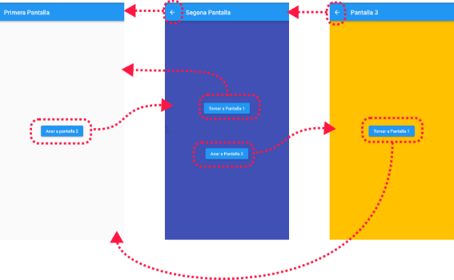

<br>

```dart
import 'package:flutter/material.dart';

void main() => runApp(const MyApp());

class MyApp extends StatelessWidget {
  const MyApp({super.key});

  @override
  Widget build(BuildContext context) {
    return const MaterialApp(
        // La página inicial del widget MaterialApp
        // es el widget Pantalla1.
        debugShowCheckedModeBanner: false,
        home: Pantalla1());
  }
}

// Pantalla 1: Incorpora un botón para navegar a
// la segonda pantalla

class Pantalla1 extends StatelessWidget {
  const Pantalla1({super.key});

  @override
  Widget build(BuildContext context) {
    return Scaffold(
      appBar: AppBar(
        title: const Text('Primera Pantalla'),
      ),
      body: Center(
        child: Column(
          mainAxisAlignment: MainAxisAlignment.center,
          children: [
            ElevatedButton(
              child: const Text('Ir a pantalla 2'),
              onPressed: () {
                Navigator.push(
                  context,
                  MaterialPageRoute(builder: (context) => const Pantalla2()),
                );
              },
            ),
          ],
        ),
      ),
    );
  }
}

// Pantalla 2: Incorpora un botón para volver a la primera
// pantalla y otro para navegar a la tercera pantalla

class Pantalla2 extends StatelessWidget {
  const Pantalla2({super.key});

  @override
  Widget build(BuildContext context) {
    return Scaffold(
      backgroundColor: Colors.indigo,
      appBar: AppBar(
        title: const Text("Segunda Pantalla"),
      ),
      body: Center(
        child: Column(
          mainAxisAlignment: MainAxisAlignment.center,
          children: [
            ElevatedButton(
              child: const Text('Volver a Pantalla 1'),
              onPressed: () {
                // Utilizamos canPop para evitar quedarnos sin
                // ninguna pantalla visible en la aplicación.
                if (Navigator.canPop(context)) Navigator.pop(context);
              },
            ),
            const Divider(height: 100),
            ElevatedButton(
              child: const Text('Ir a Pantalla 3'),
              onPressed: () {
                Navigator.push(
                  context,
                  MaterialPageRoute(builder: (context) => const Pantalla3()),
                );
              },
            )
          ],
        ),
      ),
    );
  }
}

class Pantalla3 extends StatelessWidget {
  const Pantalla3({super.key});

  @override
  Widget build(BuildContext context) {
    return Scaffold(
      backgroundColor: Colors.amber,
      appBar: AppBar(
        title: const Text("Pantalla 3"),
      ),
      body: Center(
        child: ElevatedButton(
          child: const Text('Volver a Pantalla 1'),
          onPressed: () {
            Navigator.push(
              context,
              MaterialPageRoute(builder: (context) => const Pantalla1()),
            );
          },
        ),
      ),
    );
  }
}
```

En *el siguiente gist* podéis encontrar este código funcionando: 
[https://dartpad.dev/embed-flutter.html?id=97a5f1a22f6f4afa82ddf75ea0eec11c](https://dartpad.dev/embed-flutter.html?id=97a5f1a22f6f4afa82ddf75ea0eec11c)

<div style="overflow-x: auto; width: 100%;">
  <iframe
    src="https://dartpad.dev/embed-inline.html?id=97a5f1a22f6f4afa82ddf75ea0eec11c"
    width="100%"
    height="500px"
    loading="lazy"
    frameborder="0">
  </iframe>
</div>

Probemos el ejemplo, y observemos el aspecto de la barra de la aplicación de la primera pantalla inicialmente. Después vamos hasta la tercera pantalla y haga clic en el botón para volver a la primera. Veamos de nuevo la barra de la aplicación. ¿Observáis alguna diferencia? ¿A qué creéis que puede deberse?

### **Paso de argumentos entre pantallas.**

Cuando pasamos de una ruta a otra mediante `MaterialPageRoute` proporcionamos a través de este un `builder` donde invocamos al constructor del widget que representará la nueva ruta. Este constructor puede admitir argumentos, de manera que supone una forma sencilla de compartir información entre los mismos.

Por ejemplo, podríamos definir un widget de esta manera:

```dart
class Pantalla2 extends StatelessWidget {
  final String? nom;

  const Pantalla2({this.nom, super.key});

  ...
}
```

Como vemos, hemos definido una nueva propiedad *`nom`*, que se instancia en el mismo constructor. Como podemos ver, esta propiedad se ha definido como *`final`*, de manera que podamos declarar al constructor como constante.

Ahora podemos, por ejemplo, desde un widget que contiene algún campo de texto, proporcionarle la información del mismo. En el siguiente código hemos definido un widget con estado que contiene un `TextField` gestionado por un controlador, y un botón, que al ser pulsado envía el valor de este campo de texto a la segunda pantalla:

```dart
// Pantalla1. Widget con estado donde podemos introducir un texto
// para enviar a la pantalla 2.
class Pantalla1 extends StatefulWidget {
  const Pantalla1({super.key});

  @override
  State<Pantalla1> createState() => _Pantalla1State();
}

class _Pantalla1State extends State<Pantalla1> {
  // Definimos un controlador para el TextField
  final TextEditingController _controlador = TextEditingController();

  @override
  Widget build(BuildContext context) {
    return Scaffold(
      appBar: AppBar(
        title: const Text('Bienvenida'),
      ),
      body: Center(
        child: Padding(
          padding: const EdgeInsets.all(32.0),
          child: Column(
            mainAxisAlignment: MainAxisAlignment.spaceEvenly,
            children: [
              const Text("Cómo te llamas?"),
              TextField(
                // Associem el controlador al controller
                // del TextField
                controller: _controlador,
                decoration: InputDecoration(
                  border: OutlineInputBorder(
                    borderRadius: BorderRadius.circular(10),
                  ),
                ),
              ),
              ElevatedButton(
                child: const Text('Enviar a pantalla 2'),
                onPressed: () {
                  Navigator.push(
                    context,
                    MaterialPageRoute(
                        builder: (context) => Pantalla2(nombre: _controlador.text)),
                  );
                },
              ),
            ],
          ),
        ),
      ),
    );
  }
}

// Pantalla 2: Muestra el texto que recibe como argumento del constructor

class Pantalla2 extends StatelessWidget {
  final String? nombre;

  const Pantalla2({this.nombre, super.key});

  @override
  Widget build(BuildContext context) {
    return Scaffold(
      backgroundColor: Colors.white,
      appBar: AppBar(
        title: const Text("Segunda Pantalla"),
      ),
      body: Center(child: Text("Hola $nombre")),
    );
  }
}

```

En *el siguiente gist* podéis encontrar este código funcionando: 
[https://dartpad.dev/embed-flutter.html?id=f1531398872e313a12618218eeae76f6](https://dartpad.dev/embed-flutter.html?id=f1531398872e313a12618218eeae76f6)

<div style="overflow-x: auto; width: 100%;">
  <iframe
    src="https://dartpad.dev/embed-inline.html?id=f1531398872e313a12618218eeae76f6"
    width="100%"
    height="500px"
    loading="lazy"
    frameborder="0">
  </iframe>
</div>

### **Trabajando con valores de retorno**

A veces, es posible que además de enviar datos a un widget, necesitamos recibir una respuesta por parte del mismo. 

Para conseguir esto, solo debemos proporcionar este valor de retorno, junto con el contexto, cuando *desapilamos* la ruta de la pila con el método pop:

```dart
Navigator.pop(context, ValorDeRetorno);
```

Esto implicará también cambios a la hora de *recibir* esta información en la pantalla que quedará ahora en la cima de la pila, ya que **esta respuesta se obtendrá de forma asíncrona**, de manera que la invocación se realizaría siguiendo el siguiente esquema:

```dart
String resposta = await Navigator.push(
  context,
  MaterialPageRoute(builder: (context) => Pantalla2(...)),
);
```


De esta manera, esperamos a recibir la respuesta gracias al `await`. Si queremos modificar alguna propiedad del widget de acuerdo con esta respuesta, habrá que hacer uso de un widget con estado, e invocar a `SetState()` una vez se tenga la respuesta.

Veámoslo en el siguiente ejemplo, continuación de lo que hemos visto antes, donde ahora, además de enviar datos, vamos a recibirlos en la primera pantalla.

**Modificaciones en la primera pantalla**

En primer lugar, definimos la *Pantalla1* como antes, haciendo uso de un widget con estado. Este estado contendrá el controlador del texto más una propiedad para guardar en este estado el valor de retorno (`String _valorDeRetorno`):

```dart
class Pantalla1 extends StatefulWidget {
  const Pantalla1({super.key});

  @override
  State<Pantalla1> createState() => _Pantalla1State();
}

class _Pantalla1State extends State<Pantalla1> {
  // Definimos un controlador para el TextField
  final TextEditingController _controlador = TextEditingController();

  String _valorDeRetorno = "";

  //...

}
```


Además, dentro de esta clase para el estado de la pantalla, definiremos el siguiente método que se encargará de hacer la invocación en la *Pantalla2*:

```dart
void _invocarPantalla2(BuildContext context) async {
  String respuesta = await Navigator.push(
     context,
    MaterialPageRoute(builder: (context) => Pantalla2(nom: _controlador.text)),
  );
  setState(() {
    _valorDeRetorno = respuesta;
  });
}
```

Como vemos, hacemos uso de la palabra clave `async` para definir el método y `await` con el fin de esperarnos al valor de retorno cuando hacemos el `Navigator.push()`. Además, después de obtener la respuesta, actualizamos la propiedad `_valorDeRetorno` del estado mediante `SetState()`.

Finalmente, con el fin de mostrar el valor de retorno, hemos incorporado un widget de tipo texto, el cual se renderiza sólo si la propiedad `_valorDeRetorno` contiene algún texto diferente a la cadena vacía:

```dart
Column(
  ...  
  children: [
  // Podem hacer uso de un renderizadocondicional
    if (_valorDeRetorno != "") Text("Hola $_valorDeRetorno"),
    ],
),
```

**Modificaciones en la segunda pantalla**

La segunda pantalla contendrá un `TextField` con el fin de introducir el valor de retorno, de manera que necesitaremos hacer uso de un controlador, y por lo tanto, convertir el widget en un widget con estado. Recuerde que en las acciones de código tenéis disponible la opción *Convert to Stateful*, para convertir un widget sin estado a un widget con estado.

Así pues, la definición de esta clase con su estado quedaría:

```dart
class Pantalla2 extends StatefulWidget {
  // Dato que recibios de la pantalla 1
  final String? nombre;

  // Constructor
  const Pantalla2({this.nombre, super.key});

  @override // Creación del estado
  State<Pantalla2> createState() => _Pantalla2State();
}

// Estado de la pantalla 2, donde definimos  el controlador
class _Pantalla2State extends State<Pantalla2> {
  final TextEditingController _controlador = TextEditingController();

  ...
}
```

Y dentro del método `build` del estado tendremos el siguiente código, donde establecemos el gestor para el evento `onPressed` del botón de devolver datos, dentro del cual hacemos el `pop` proporcionando el contenido del TextField mediante su controlador.

```dart
Column(
  ...
  children: [
    Text("Hola ${widget.nom}, introduce ahora un texto de retorno"),
      TextField(
        controller: _controlador,
        ...
        ),
      ElevatedButton(
        child: const Text('Devuelve datos'),
          onPressed: () {
            Navigator.pop(context, _controlador.text);
            },
        ),
    ],
  )
...
```

Como podéis comprobar, el *nombre* que nos proporciona la primera pantalla se guarda en una propiedad `nombre` del widget *Pantalla2*, pero necesitamos acceder a él en el método `build` de su estado. 

**Con el fin de acceder a una propiedad de un dueño desde su estado, hacemos uso de la propiedad widget del propio estado, que es una referencia al giny asociado a este estado.** Así pues, con el fin de crear un Texto con esta propiedad *nombre* como contenido, hemos hecho:

```dart
Text("Hola·${widget.nom}, introduce ahora un texto de retorno")
```

En este caso, para hacer la interpolación de variables, sí hemos necesitado hacer uso de las claves para acotar el nombre completo de la variable: ${wigdet.nom}.

En *el siguiente gist* podéis encontrar este código funcionando: 
[https://dartpad.dev/embed-flutter.html?id=3a67eb229b967dfe1dc428cecad5d1bb](https://dartpad.dev/embed-flutter.html?id=3a67eb229b967dfe1dc428cecad5d1bb)

<div style="overflow-x: auto; width: 100%;">
  <iframe
    src="https://dartpad.dev/embed-inline.html?id=3a67eb229b967dfe1dc428cecad5d1bb"
    width="100%"
    height="500px"
    loading="lazy"
    frameborder="0">
  </iframe>
</div>

<br>

## Rutas con nombre

Otra forma de utilizar el `Navigator` es haciendo uso de ***rutas con nombre***, que nos permiten referenciar las diferentes rutas desde diversos lugares de la aplicación. Cuando utilicemos el `Navigator` con rutas con nombre haremos uso del método `pushNamed` en lugar de `push` para apilar una nueva ruta.

Hasta ahora, en las aplicaciones *MaterialApp*, hemos definido su propiedad `title` y su propiedad `home`, que hace referencia al widget que hará de página de inicio de la aplicación. Con el fin de definir *rutas con nombre*, lo que hacemos es añadir al *MaterialApp* una nueva propiedad llamada `routes`, y reemplazar la propiedad `home` por `initialRoute`, para definir así la ruta de inicio. Esta propiedad `routes` es un diccionario que asocia el nombre de la ruta con una función anónima para construir el contenido.

Vemos un ejemplo donde vamos a adaptar el ejemplo de las tres pantallas anteriores, pero ahora haciendo uso de tres rutas con nombre:

```dart
void main() => runApp(const MyApp());

class MyApp extends StatelessWidget {
  const MyApp({super.key});

  @override
  Widget build(BuildContext context) {
    return MaterialApp(
      title: 'Rutas',
      initialRoute: '/',
      routes: {
        '/': (context) => const Pantalla1(),
        '/pantalla2': (context) => const Pantalla2(),
        '/pantalla3': (context) => const Pantalla3(),
      },
    );
  }
}
```

Como vemos, la propiedad `routes` define las siguientes rutas:

- El nombre de ruta `/`, que definirá la ruta a la *Pantalla1*, y que tal como indica la propiedad initialRoute es la ruta de inicio.
- El nombre de ruta `/pantalla2`, que definirá la ruta a la *Pantalla2*, y
- El nombre de ruta `/pantalla3`, que definirá la ruta a la *Pantalla3*.

Con el fin de realizar la navegación entre las diferentes pantallas mediante estos nombres, haremos uso del método `Navigator.pushNamed` de la siguiente forma:

```dart
Navigator.pushNamed(context, '/nombre_de_la_ruta');
```

Veamos el ejemplo completo con las tres rutas y los diferentes botones para navegar entre ellas:

```dart
import 'package:flutter/material.dart';

void main() => runApp(const MyApp());

class MyApp extends StatelessWidget {
  const MyApp({super.key});

  @override
  Widget build(BuildContext context) {
    return MaterialApp(
      title: 'Rutas',
      // En lugar de  home, definimos la ruta inicial
      // y la lista de rutas con nombre.
      initialRoute: '/',
      routes: {
        '/': (context) => const Pantalla1(),
        '/pantalla2': (context) => const Pantalla2(),
        '/pantalla3': (context) => const Pantalla3(),
      },
    );
  }
}

// Pantalla 1: Incorpora un botón para navegar a
// la segunda pantalla

class Pantalla1 extends StatelessWidget {
  const Pantalla1({super.key});

  @override
  Widget build(BuildContext context) {
    return Scaffold(
      appBar: AppBar(
        title: const Text('Primera Pantalla'),
      ),
      body: Center(
        child: Column(
          mainAxisAlignment: MainAxisAlignment.center,
          children: [
            ElevatedButton(
              child: const Text('Ir a pantalla 2'),
              onPressed: () {
                Navigator.pushNamed(context, '/pantalla2');
              },
            ),
          ],
        ),
      ),
    );
  }
}

// Pantalla 2: Incorpora un botón para volver a la primera
// pantalla y otro para navegar a la tercera pantalla

class Pantalla2 extends StatelessWidget {
  const Pantalla2({super.key});

  @override
  Widget build(BuildContext context) {
    return Scaffold(
      backgroundColor: Colors.indigo,
      appBar: AppBar(
        title: const Text("Segunda Pantalla"),
      ),
      body: Center(
        child: Column(
          mainAxisAlignment: MainAxisAlignment.center,
          children: [
            ElevatedButton(
              child: const Text('Volver a la Pantalla 1'),
              onPressed: () {
                // Utilizamos canPop para evitar quedarnos sin
                // ninguna pantalla visible en la aplicación.
                if (Navigator.canPop(context)) Navigator.pop(context);
              },
            ),
            const Divider(height: 100),
            ElevatedButton(
              child: const Text('Ir a Pantalla 3'),
              onPressed: () {
                Navigator.pushNamed(context, '/pantalla3');
              },
            )
          ],
        ),
      ),
    );
  }
}

class Pantalla3 extends StatelessWidget {
  const Pantalla3({super.key});

  @override
  Widget build(BuildContext context) {
    return Scaffold(
      backgroundColor: Colors.amber,
      appBar: AppBar(
        title: const Text("Pantalla 3"),
      ),
      body: Center(
        child: ElevatedButton(
          child: const Text('Volver a Pantalla 1'),
          onPressed: () {
            Navigator.pushNamed(context, '/');
            //Navigator.pushReplacementNamed(context, '/');
          },
        ),
      ),
    );
  }
}
```

[https://dartpad.dev/embed-flutter.html?id=8b0e80c0974757454d53a0c118aa8a30](https://dartpad.dev/embed-flutter.html?id=8b0e80c0974757454d53a0c118aa8a30)

<div style="overflow-x: auto; width: 100%;">
  <iframe
    src="https://dartpad.dev/embed-inline.html?id=8b0e80c0974757454d53a0c118aa8a30"
    width="100%"
    height="500px"
    loading="lazy"
    frameborder="0">
  </iframe>
</div>

- El método `canPop()`: En la segunda pantalla se ha hecho uso del orden `canPop()` de la siguiente manera: `if (Navigator.canPop(context)) Navigator.pop(context);`. Este método nos devuelve un valor lógico si, como su nombre indica, la pantalla que tenemos *puede hacer pop*. Básicamente, esto lo podemos utilizar para asegurarnos de que la pantalla que vamos a quitar del tope de la pila no es la única que queda en esta. Si hiciéramos un `pop` en este caso, quitaríamos la pantalla de la pila y se quedaría la aplicación en negro.
  
- Como vemos, cuando tenemos más de una pantalla en la pila de rutas, y por lo tanto se puede hacer `pop`, dispondremos de un icono en forma de flecha para ir atrás a la parte izquierda de la barra de la aplicación. Además, algunas plataformas ofrecen un sistema de navegación integrado en la misma interfaz de usuario, como por ejemplo Android, con el botón de ir atrás.
  
- Finalmente, en la *Pantalla3* del ejemplo, aparece comentado el método `Navigator.pushNamedAndRemoveUntil(context, '/', (Route<dynamic> route) => false);`. Este método, lo que hace ahora es *vaciar* la pila y añadir la ruta que le indicamos al tope de la misma. Este método recibe un tercer parámetro, que es una función que indica qué rutas se deben eliminar de la pila. En este caso, como devolvemos siempre *false* indicamos que hay que borrar todas las rutas.

<br>
<br>

# <a name="_apartado4"></a>4. Widgets de navegación

En el apartado anterior hemos visto cómo trabaja la navegación entre diferentes pantallas mediante el componente *Navigator* y las rutas. 

Presentaremos ahora algunos widgets que nos serán de gran ayuda en la navegación, como los `Drawers` (literalmente *cajoneras*, por su aspecto), las pestañas o las barras y *`rails`* de navegación.

## El componente Drawer

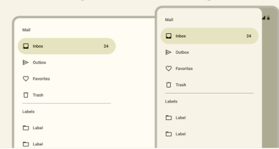


El componente *Drawer* (Navigation Drawer) junto con los Tabs es uno de los mecanismos de navegación entre pantallas más habitual en aplicaciones Material Design. Un *Drawer* consiste en un menú lateral de navegación, que nos permite desplazarnos entre diferentes pantallas, y se compone principalmente de una cabecera y una lista de opciones.

El componente `Scaffold`, como vimos, dispone de una propiedad `drawer` para integrar este componente en el esqueleto de una aplicación Material. 

El widget `Drawer` tendrá un widget hijo que será un `ListView`, de manera que podamos mostrar las diferentes opciones y hagamos posible que el usuario pueda desplazarse por ellas si no hay suficiente espacio vertical. El primer elemento de esta lista será un widget de tipo `DrawHeader` con la cabecera del *Drawer*. El resto de elementos serán de tipo `ListTitle` con las diferentes opciones. Estos widgets, internamente se compondrán otros widgets como textos o imágenes.

Además, cada ListTitle tendrá asociado un *callback* asociado al evento `onTap`, dentro del cual gestionaremos la navegación en sí. Para esta navegación deberemos tener en cuenta en qué ruta nos encontramos y hacia qué rutas podemos ir, así como gestionar la pila de las diferentes rutas.

Esquemáticamente, e introduciendo un poco de código tendríamos lo siguiente:

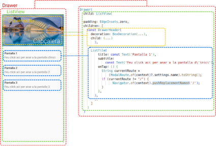

Como vemos, dentro del gestor del evento `onTap` se hace uso de la clase abstracta `ModalRoute` para obtener la ruta en la que nos encontramos:

```dart
String currentRoute = (ModalRoute.of(context)?.settings.name).toString();
```

Con `ModalRoute.of(context)` obtenemos la ruta más cercana a nuestro contexto, y desde ésta accedimos a su propiedad `settings.name`, que nos devolverá el nombre de esta ruta. 

De esta manera, compararemos esta *ruta actual* con la ruta destino, de manera que sólo realizamos la navegación si esta ruta no es la misma:

```dart
  if (currentRoute != "/") {
    Navigator.of(context).pushReplacementNamed('/');
  }
```

Observe también que estamos haciendo uso del método `pushReplacementNamed`, con el fin de reemplazar la ruta en la pila, de manera que sea el *Drawer* quien gestione la navegación y no nos aparezca el icono de *Ir Atrás*. De hecho, en su lugar, aparecerá el icono del menú para desplegar el Drawer.

En *el siguiente gist* podéis encontrar este código funcionando: 

[https://dartpad.dev/embed-flutter.html?id=4714cff25cc4fb552c81763132234601](https://dartpad.dev/embed-flutter.html?id=4714cff25cc4fb552c81763132234601)

<div style="overflow-x: auto; width: 100%;">
  <iframe
    src="https://dartpad.dev/embed-inline.html?id=4714cff25cc4fb552c81763132234601"
    width="100%"
    height="500px"
    loading="lazy"
    frameborder="0">
  </iframe>
</div>

<br>

## Navegación con Tabs

Otro mecanismo de navegación definido en la librería Material son los Tabs o pestañas, que nos permiten organizar el contenido en diferentes pantallas o agrupaciones de datos.

Material define dos tipos de pestañas: las principales y las secundarias, de manera que hacen posible la organización del contenido en categorías para facilitar el acceso a la información por parte del usuario.

Estas pestañas se ubican una al lado de la otra, distinguiendo entre categorías de igual importancia, y admiten desplazamiento horizontal, de manera que podemos disponer de tantas pestañas como sea necesario.

### **Los Widgets TabBar y TabBarView**

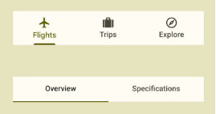

Con Flutter podemos crear una fila de pestañas con el componente `TabBar`, que generalmente se ubicará en la parte inferior de la barra de la aplicación. Además, el `TabBar` trabajará conjuntamente con el widget `TabBarView`, que será el contenedor donde se visualizará el contenido de las diferentes pestañas, y con un `TabController`, para controlar el comportamiento de las mismas.

La forma más sencilla de implementar pestañas es haciendo uso del controlador predeterminado `DefaultTabController`, con lo que especificamos cuántas pestañas contendrá la fila y cuál será la pestaña inicial.

Esquemáticamente, podemos ver los diferentes widgets que componen este esquema de navegación en el siguiente árbol:

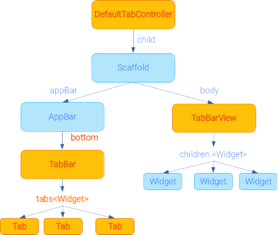

Como vemos, el widget principal será el `DefaultTabController`, que es quien controlará la cantidad de pestañas y cuál será la pestaña inicial. Este controlador tendrá por hijo al *Scaffold*. Dentro de la *AppBar* del mismo, en la propiedad `bottom` ubicaremos la fila de pestañas, mediante el widget `TabBar`, que contendrá una lista de widgets de tipo `Tab` (tantos como se haya indicado en el *DefaultTabController*). Por otro lado, en el componente `body` del ***Scaffold*** tendremos un widget `TabBarView`, que contendrá tantos elementos hijos como pestañas se haya indicado en el controlador. **La correspondencia entre las pestañas y su contenido será en el orden en que se han definido: la primera pestaña lleva al primer widget, la segunda al segundo, etc.**

Según todo esto, la longitud que definimos en el *DefaultTabController* debe ser igual a la longitud de la lista de pestañas (`TabBar.tabs`) y a la de la lista de ginys (`TabBarView.children`).

Veámoslo todo más claro con el siguiente ejemplo basado en la misma documentación de Flutter:

```dart
import 'package:flutter/material.dart';

void main() => runApp(const MyApp());

class MyApp extends StatelessWidget {
  const MyApp({super.key});

  static const String _title = 'Ejemplo de Pestañas';

  @override
  Widget build(BuildContext context) {
    return const MaterialApp(
      title: _title,
      home: MyStatelessWidget(),
    );
  }
}

class MyStatelessWidget extends StatelessWidget {
  const MyStatelessWidget({super.key});

  @override
  Widget build(BuildContext context) {
    /* 
    El widget comienza con un DefaultTabController, donde indicamos
    el número de pestañas (length) y el índice de la pestaña
    predeterminada (initialIndex)
    */
    return DefaultTabController(
      initialIndex: 1,
      length: 3,
      child: Scaffold(
        appBar: AppBar(
          title: const Text('Ejemplo de Pestañas'),
          /*
          El componente bottom de la AppBar contiene el 
          TabBar, que define las diferentes pestañas.
          Los tabs pueden contener un texto y un icono, 
          pero al menos una de las dos cosas.

          */
          bottom: const TabBar(
            tabs: <Widget>[
              Tab(
                text: "Sol",
                icon: Icon(Icons.sunny),
              ),
              Tab(
                text: "Nubes",
                icon: Icon(Icons.cloud_outlined),
              ),
              Tab(
                text: "Lluvia",
                icon: Icon(Icons.beach_access_sharp),
              ),
            ],
          ),
        ),
        // El widget TabBarWidget define los distintos
        // contenedores para el contenido de cada pestaña
        // Esta lista de widgets, pueden ser tanto predefinidos
        // como widgets personalizados con todo el contenido que queramos.
        body: const TabBarView(
          children: <Widget>[ // Contenido de la primera pestaña
            Center(
              child: Text("Soleado"),
            ),
            Center( // Contenido de la segunda 
              child: Text("Nuboso"),
            ),
            Center( // Contenido de la tercera pestaña
              child: Text("Lluvia"),
            ),
          ],
        ),
      ),
    );
  }
}
```

En *el siguiente gist* podéis encontrar este código funcionando: 

[https://dartpad.dev/embed-flutter.html?id=37a03cce1d60ad90865f1ab200afbe83](https://dartpad.dev/embed-flutter.html?id=37a03cce1d60ad90865f1ab200afbe83)

<div style="overflow-x: auto; width: 100%;">
  <iframe
    src="https://dartpad.dev/embed-inline.html?id=37a03cce1d60ad90865f1ab200afbe83"
    width="100%"
    height="500px"
    loading="lazy"
    frameborder="0">
  </iframe>
</div>

<br>

Como veis, cada elemento hijo del `TabBarView` lo hemos definido como un widget de tipo `Center` con un texto. Cuando creamos nuestras aplicaciones con esta navegación, lo que haremos será instanciar aquí **nuestros widgets personalizados**.

<br>

## Navigation bar

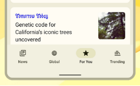

Otra forma propuesta por Material 3 de navegar por los destinos principales de una aplicación es mediante la barra de navegación (*NavigationBar*).

Se trata de un widget que contiene una colección de destinos, normalmente de tipo *NavigationDestinations.* Este widget, además, tiene dos propiedades importantes: `selectedIndex`, con el índice del destino seleccionado, y `onDestionationSelected`, que tiene asociado un callback que se dispara cuando el usuario selecciona algún destino en la barra:

```dart
 NavigationBar(
    onDestinationSelected: (int index) {...},
    selectedIndex: indexActual,
    destinations: const <Widget>[
      NavigationDestination(...),
      NavigationDestination(...),
      ...
)
```

El widget `NavigationBar`, generalmente se ubica en el componente `bottomNavigationBar` del `Scaffold`. El componente donde definimos esta barra de navegación **deberá ser un widget con estado**, y el estado de éste, almacenará el índice seleccionado en cada momento (que llamaremos `indexActual`), y que como vemos en el código de arriba, es quien marca el valor para `selectedIndex` al `NavigationBar`. Además, el componente `body` del `Scaffold` se obtendrá a partir de una lista de widgets, de entre la que se cogerá el widget que se ubique en cada momento en la posición que marque `indexActual`:

```dart
class ExempleBottomNavigationBar extends StatefulWidget {
  ...

  @override
  State<ExempleBottomNavigationBar> createState() =>
      _ExempleBottomNavigationBarState(); }

class _ExempleBottomNavigationBarState
    extends State<ExempleBottomNavigationBar> {

  int indexActual = 0;

  @override
  Widget build(BuildContext context) {
    return Scaffold(
      appBar: ...,
      bottomNavigationBar: NavigationBar(...),
      ),
      body: <Widget>[
        Container(...), // Widget para el contenido del destino 1
        Container(...), // Widget para el contenido del destino 1
        ...
      ][indexActual],  // Aquí seleccionamos el contenido correspondiente
    );
  }
}
```

Cuando el usuario selecciona un destino, se dispara el evento `onDestinationSelected`, en cuyo callback actualizaremos el valor del índice seleccionado en el estado, y actualizando éste, provocamos que se actualice también la interfaz (el `body`) con el contenido correspondiente:

```dart
 onDestinationSelected: (int index) {
  setState(() {
    indexActual = index;
  });
}
```

Podemos verlo esquemáticamente aquí:

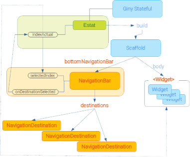

Vemos el código del ejemplo completo, basado en los ejemplos de la documentación de Flutter:

```dart
import 'package:flutter/material.dart';

void main() => runApp(const MyApp());

class MyApp extends StatelessWidget {
  const MyApp({super.key});

  @override
  Widget build(BuildContext context) {
    return const MaterialApp(
      title: 'Ejemplo con BottomNavigationBar',
      home: ExempleBottomNavigationBar(),
    );
  }
}

class ExempleBottomNavigationBar extends StatefulWidget {
  const ExempleBottomNavigationBar({
    Key? key,
  }) : super(key: key);

  @override
  State<ExempleBottomNavigationBar> createState() =>
      _ExempleBottomNavigationBarState();
}

class _ExempleBottomNavigationBarState
    extends State<ExempleBottomNavigationBar> {
  int indexActual = 0;

  @override
  Widget build(BuildContext context) {
    return Scaffold(
      appBar: AppBar(
        title: [
          const Text('Barra de la aplicación del destino 1'),
          const Text('Barra de la aplicación del destino 2'),
          const Text('Barra de la aplicación del destino 3')
        ][indexActual],
      ),
      bottomNavigationBar: NavigationBar(
        onDestinationSelected: (int index) {
          setState(() {
            indexActual = index;
          });
        },
        selectedIndex: indexActual,
        destinations: const <Widget>[
          NavigationDestination(
            icon: Icon(Icons.home_outlined),
            selectedIcon: Icon(Icons.home),
            label: 'Destino 1',
          ),
          NavigationDestination(
            icon: Icon(Icons.people_outline),
            selectedIcon: Icon(Icons.people),
            label: 'Destino 2',
          ),
          NavigationDestination(
            icon: Icon(Icons.work_outline),
            selectedIcon: Icon(Icons.work),
            label: 'Destino 3',
          ),
        ],
      ),
      body: <Widget>[
        Container(
          color: Colors.amber,
          alignment: Alignment.center,
          child: const Text('Contenido del destino 1'),
        ),
        Container(
          color: Colors.lime,
          alignment: Alignment.center,
          child: const Text('Contenido del destino 2'),
        ),
        Container(
          color: Colors.teal,
          alignment: Alignment.center,
          child: const Text('Contenido del destino 3'),
        ),
      ][indexActual],
    );
  }
}
```

En el ejemplo anterior, notemos que con el fin de modificar el contenido de la AppBar en función del índice, hemos aplicado el mismo mecanismo que para el `body`, de manera que hagamos uso del índice seleccionado actualmente para establecer uno u otro elemento de la lista de AppBar.

En *el siguiente gist* podéis encontrar este código funcionando: 

[https://dartpad.dev/embed-flutter.html?id=fe8d6ca53dcef2bb137b6c74df73fd60](https://dartpad.dev/embed-flutter.html?id=fe8d6ca53dcef2bb137b6c74df73fd60)

<div style="overflow-x: auto; width: 100%;">
  <iframe
    src="https://dartpad.dev/embed-inline.html?id=fe8d6ca53dcef2bb137b6c74df73fd60"
    width="100%"
    height="500px"
    loading="lazy"
    frameborder="0">
  </iframe>
</div>

<hr> 
### ¿Cuándo utilizar barras de navegación o pestañas?

Las barras de navegación se usan para acceder a destinos principales de la aplicación, y que requieren ser accesibles desde cualquier lugar de la misma. 

Además, se aconseja cuando puedan haber entre tres y cinco destinos. En caso de haber más, ya haríamos uso de diferentes pestañas, ya que éstas permiten el desplazamiento horizontal entre ellas.

Además, el uso de estas barras solo se aconseja para dispositivos móviles o tabletas. 
<hr>

<br>

## Navigation Rail

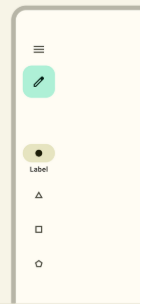

El componente *Navigation Rail* o carril de navegación de Material 3 sería el equivalente al *NavigationBar* para aplicaciones de escritorio o de tableta que se muestran en formato apaisado. Se trata de un widget en forma de columna que puede mostrarse tanto a izquierda como a derecha, y permite navegar entre unos pocos destinos, generalmente, de tres a cinco.

La principal diferencia respecto al `NavigationBar` es que ahora no disponemos de una propiedad en el *Scaffold* específica para el widget, y debemos añadirla como una columna dentro de la propiedad `body`. Así pues, el esquema general quedará:

```dart
Scaffold(
 appBar: AppBar(...), // Internamente igual que antes
  body: Row(
    children: <Widget>[
      NavigationRail(...), // Columna con el Navigarion Rail
      const VerticalDivider(thickness: 1, width: 1), // Divisor vertical
      Expanded(...) // Contenido Principal
      ]
    )     
  )
}
```

Como vemos, dentro del `body` hemos añadido una columna (`Row`), cuyo primer elemento es el `NavigationRail`, luego añadimos una línea de separación (`VerticalDivider`) y luego, con un `Expanded` añadiremos el contenido principal, en función de lo que haya seleccionado en el Índice.

Algunas de las propiedades básicas del `NavigationRail` son las siguientes:

- `selectedIndex`: El índice del destino seleccionado.
- `onDestinationSelected`: Define el callback que se invoca cuando el usuario elige un destino.
- `destinations` Una lista de elementos de tipo `NavigationRailDestination`, con los diferentes destinos. Estos elementos, entre otros pueden tener las propiedades `icon` (icono), `selectedIcon` (icono cuando está seleccionada), o `label` con la etiqueta del destino.
- `labelType`: Un valor de tipo `NavigationRailLabelType` que indica cómo se muestran las etiquetas en los iconos. Sus valores pueden ser `all` para mostrar todas las etiquetas, `none` para no ver ninguna, o `selected`, para mostrar sólo la etiqueta del destino seleccionado.
- `extended`: Para ver el componente de forma extendida, mostrando el icono y la etiqueta a su derecha, en lugar de debajo, de manera que la columna ocupa un mayor espacio.

Vemos en el siguiente ejemplo cómo adaptaríamos el ejemplo del NavigationBar anterior a un *NavigationRail*:

```dart
import 'package:flutter/material.dart';

void main() => runApp(const MyApp());

class MyApp extends StatelessWidget {
  const MyApp({super.key});

  @override
  Widget build(BuildContext context) {
    return const MaterialApp(
      title: 'Ejemplo con NavigationRail',
      home: ExempleNavigationRail(),
    );
  }
}

class ExempleNavigationRail extends StatefulWidget {
  const ExempleNavigationRail({
    Key? key,
  }) : super(key: key);

  @override
  State<ExempleNavigationRail> createState() => _ExempleNavigationRailState();
}

class _ExempleNavigationRailState extends State<ExempleNavigationRail> {
  int indexActual = 0;

  @override
  Widget build(BuildContext context) {
    return Scaffold(
      appBar: AppBar(
        title: [
          const Text('Barra de la aplicación del destino 1'),
          const Text('Barra de la aplicación del destino 2'),
          const Text('Barra de la aplicación del destino 3')
        ][indexActual],
      ),
      body: Row(
        children: <Widget>[
          NavigationRail(
            labelType: NavigationRailLabelType.all,
            selectedIndex: indexActual,
            onDestinationSelected: (int index) {
              setState(() {
                indexActual = index;
              });
            },
            destinations: const <NavigationRailDestination>[
              NavigationRailDestination(
                icon: Icon(Icons.home_outlined),
                selectedIcon: Icon(Icons.home),
                label: Text('Destino 1'),
              ),
              NavigationRailDestination(
                icon: Icon(Icons.people_outline),
                selectedIcon: Icon(Icons.people),
                label: Text('Destino 2'),
              ),
              NavigationRailDestination(
                icon: Icon(Icons.work_outline),
                selectedIcon: Icon(Icons.work),
                label: Text('Destí 3'),
              ),
            ],
          ),
          const VerticalDivider(thickness: 1, width: 1),
          // Contingut PRincipal
          Expanded(
            child: <Widget>[
              Container(
                color: Colors.amber,
                alignment: Alignment.center,
                child: const Text('Contenido del destino 1'),
              ),
              Container(
                color: Colors.lime,
                alignment: Alignment.center,
                child: const Text('Contenido del destino 2'),
              ),
              Container(
                color: Colors.teal,
                alignment: Alignment.center,
                child: const Text('Contenido del destino 3'),
              ),
            ][indexActual],
          ),
        ],
      ),
    );
  }
}
```
En *el siguiente gist* podéis encontrar este código funcionando: 
[https://dartpad.dev/embed-flutter.html?id=ccc983b16b597e01e36948adef557bd8](https://dartpad.dev/embed-flutter.html?id=ccc983b16b597e01e36948adef557bd8)

<div style="overflow-x: auto; width: 100%;">
  <iframe
    src="https://dartpad.dev/embed-inline.html?id=ccc983b16b597e01e36948adef557bd8"
    width="100%"
    height="500px"
    loading="lazy"
    frameborder="0">
  </iframe>
</div>

<br>
<br>

# <a name="_apartado5"></a>5. Diálogos

La [documentación de Material 3](https://m3.material.io/components/dialogs/guidelines#89a9e18e-b7d6-4a8b-9640-07c28a49f8c0) define un diálogo (también conocidos como *cuadros de diálogo*) como una *ventana modal que aparece ante el contenido de la aplicación para proporcionar información crítica o pedir una decisión.*

## Uso de diálogos

El hecho de que los diálogos sean *modales* significa que se ubican delante de la interfaz, y desactivan todas las funcionalidades de la aplicación hasta que se realice la acción requerida por éstos.

Dada su naturaleza *interruptiva* los diálogos deben utilizarse con moderación, y restringirlos a aquellas acciones que bloquean el funcionamiento normal de la aplicación, como pueda ser requerir una acción por parte del usuario, comunicar información crítica o ayudar a los usuarios a realizar una tarea.

Para mostrar información menos prioritaria es preferible hacer uso de otros widgets que pueden ser descartados o que desaparecen de manera automática, como puedan ser los *SnackBars* o los *MaterialBanners* que ya hemos visto.

## Tipos de diálogos

En Material distinguimos dos tipos de diálogos en cuanto a su presentación, los básicos y los diálogos a pantalla completa.

Los diálogos básicos ocupan sólo una parte de la pantalla, pero dejan inaccesible el resto de pantalla. Dentro de estos podemos mostrar alertas o mensajes de confirmación que requieran de la atención del usuario y de alguna acción por su parte.

Por su parte, los diálogos a pantalla completa ocupan toda la pantalla y requieren completar varias acciones antes de cerrarlo, como pueda ser rellenar varios campos de un formulario.

En la documentación de Material se nos explican los diferentes elementos que conforman un diálogo, tanto básico como de pantalla completa:

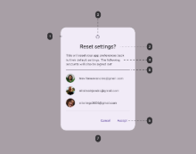

En éste, distinguimos los siguientes elementos:

1. Contenedor del diálogo
2. Icono (opcional)
3. Cabecera (Opcional)
4. Texto del diálogo
5. Divisor (Divider, opcional)
6. Acciones
7. *Scrim*, una capa temporal entre el diálogo y la interfaz sobre la que se superpone, ocultándola parcialmente, y que hace posible este comportamiento *modal*.

Por su parte, los diálogos modales tienen la siguiente estructura:

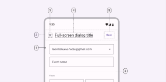

Que contiene los siguientes elementos:

1. Contenedor
2. Espacio de la cabecera
3. Icono para poder cerrar el diálogo
4. Cabecera (opcional)
5. Acciones
6. Divisor (opcional)

<br>

## La clase Dialog y la función showDialog

La clase base para trabajar con diálogos en Flutter es `Dialog`, aunque generalmente se hará uso de sus subclases `AlertDialog` y `SimpleDialog`.

Para mostrar cualquier diálogo, hacemos uso de la función `showDialog`, definida en la librería *Material*. Esta función nos permite especificar diversos parámetros como los colores, las animaciones o el comportamiento de la barrera modal (*Scrim*).

La definición de esta función es la siguiente:

```dart
Future<T?> showDialog<T>({
  required BuildContext context,
  required Widget Function(BuildContext) builder,
  bool barrierDismissible = true,
  Color? barrierColor = Colors.black54,
  String? barrierLabel,
  bool useSafeArea = true,
  bool useRootNavigator = true,
  RouteSettings? routeSettings,
  Offset? anchorPoint,
})
```


Que contiene los siguientes parámetros obligatorios:

- `context`: El contexto de construcción. Este se usará para conocer el *Navigator* y el *Theme* para el diálogo, pero no será un contexto compartido entre el diálogo y la ventana que lo invoca.
  
- `builder`: Este segundo parámetro obligatorio es una función anónima que nos devuelve el widget correspondiente al diálogo. Dentro de esta función es donde deberemos crear su contenido.

Además de estos, tenemos otros argumentos opcionales, entre ellos:

- `barrierDismisable`: un valor lógico con el que damos la posibilidad de cerrar el diálogo tocando en la parte exterior del mismo (la barrera modal o *scrim*). De manera predeterminada, toma valor *true*.
  
- `barrierColor`: nos permite especificar el color de la barrera modal (*scrim*).
- `useSafeArea`: Un valor lógico con valor predeterminado a cierto, y que establece si el campo de diálogo sólo debe mostrarse en áreas *seguras*, o lo que es lo mismo, zonas de la pantalla que no utiliza el sistema operativo.

Al igual que cuando trabajamos con la pila de rutas, el diálogo devuelve un Future mediante el método Navigator.pop() cuando cerramos el cuadro de diálogo.

<br>

## **AlertDialog**

El `AlertDialog` se usa cuando queremos informar al usuario sobre ciertas situaciones que requieren alguna respuesta por su parte. Generalmente, se compone de un título (`title`), un contenido (`content`) y una lista de acciones (`actions`). Cuando el contenido es demasiado grande para caber en la pantalla, el título y las acciones se mantienen, y es el contenido el que se desborda. Para evitar esto, a menudo suele recurrirse a un `SingleChildScrollView` para que gestione el scroll en el contenido.

Vemos cómo sería el código para crear un `AlertDialog` sencillo cuando se apriete un botón:

```dart

ElevatedButton(
onPressed: () {
    // Cuando se pulse el botón mostramos el diálogo
    showDialog(
        // Proporcionamos el context
        context: context,
        // Y la función (builder) que construye el diálogo
        builder: (context) {
        // Consistirá en un AlertDialog que tendrá
        // * Un título (title)
        // * El contenido (content)
        // * Y un botón de acciones(De tipo TextButton)
        return AlertDialog(
            title: const Text("Ejemplo de Alert Dialog"),
            content: const Text("Contenido del cuadro de diálogo"),
            actions: [
            TextButton(
                // Cuando se hace click en este botón se desapila
                // el diálogo para volver a la vista anterior.
                onPressed: () {
                Navigator.pop(context, "Cancelar");
                },
                child: const Text("Cancelar"),
            ),
            ],
        );
        });
},
// Contenido del ElevatedButton
child: const Text("Muestra un AlertDialog"),
)
```

Como vemos, lo más habitual es proporcionarle al `AlertDialog` el título para la cabecera, el contenido del mismo y una lista con los diferentes botones de acción. Observe que estos botones son de tipo `TextButton`. Como el diálogo ya es un widget que contiene elevación, según las indicaciones de *Material Design*, no se deberían incluir otros elementos con elevación dentro, por eso dentro de un diálogo se hace uso de este tipo de botones. Ten en cuenta que, aunque al ejemplo solo hemos añadido un botón para simplificar, se trata de una lista en la que caben más botones.

Finalmente, como veis, la forma de *cerrar* el diálogo es desapilando este de la pila de rutas mediante un `Navigator.pop`. Para ello es para lo que necesitamos proporcionarle el ***context*** en su creación, ya que sin él, no tendría acceso al *Navigator*. En este caso, además, cuando hacemos el ***pop***, devolvemos también el valor **Cancelar**.

Como en todo widget de Material, necesitamos que este *AlertDialog* se encuentre dentro de un widget que tenga un ascendiente de tipo *Material*, como por ejemplo *MaterialApp*. En caso contrario, obtendremos la excepción *No MaterialLocalizations found*.

Recuerde que no será suficiente con añadir el código directamente al `body` de un *MaterialApp*, sino que debe estar en otro widget y añadir éste al `body`.

### **Capturando el valor de retorno**

Para informarnos sobre el valor que el usuario ha seleccionado al diálogo, se hace uso de un `Future`, con el valor de retorno. Podemos bien hacer uso de `async/await` para capturarlo, o bien tratando con este *Future* con el `then`. Por ejemplo:

```dart
ElevatedButton(
  onPressed: () {
    // Cuando se apriete el botón mostraremos el diálogo
    Future<String?> respuesta = showDialog(
        // ...
    );
    // Cuando se reciba la respuesta la mostraremos por consola
    respuesta.then((value) => debugPrint(value));
  } 
  ...
),
```
En este ejemplo, si hacemos clic en el botón de *Cancelar*, se mostrará en la consola el texto *Cancelar*. 

Otra forma de cerrar el diálogo, ya que no hemos especificado lo contrario a la propiedad `barrierDismisable` es haciendo clic en la parte exterior del diálogo. En este caso, el valor que nos devolverá será *null*. Si queremos que el usuario obligatoriamente haga clic en algún botón del diálogo para cerrar el mismo, deberíamos especificar este valor a *false* (`barrierDimisable: false`). 

Otra opción es no devolver nada cuando se trata del valor Cancelar, y hacer directamente un `Navigator.pop(context)`, de manera que retorne *null* en ambos casos. Sabremos así que este es el valor que se nos devolverá cuando se cancela el diálogo de cualquiera de las dos formas.

<br>

## SimpleDialog

La subclase `SimpleDialog` representa un diálogo un poco más avanzado, donde se ofrece al usuario la posibilidad de escoger entre diferentes opciones.

Este diálogo contiene un título (aunque es opcional) y una lista con las diferentes opciones, que generalmente son widgets del tipo `SimpleDialogOption`. Estos widgets tendrán dos componentes: `onPressed` con la función anónima que determina la acción a realizar para la opción (generalmente cerrar el diálogo devolviendo un valor concreto), y el componente `child`, con el contenido que se mostrará en la opción (generalmente un texto).

Veámoslo en el siguiente ejemplo que presenta un diálogo con tres opciones:

```dart
showDialog(
// Proporcionamos el context
context: context,
// Y la función  (builder) que constituye el diálogo
builder: (context) {
    // Consistirá en un AlertDialog que contendrá
    // * Un título (title)
    // * Diferentes widgets (SimpleDialogOpcion) con las opciones
    return SimpleDialog(
    title: const Text("Ejemplo de Simple Dialog"),
    children: <Widget>[
        SimpleDialogOption(
        onPressed: () {
            Navigator.pop(context, "Opción 1");
        },
        child: const Text('Opción 1'),
        ),
        SimpleDialogOption(
        onPressed: () {
            Navigator.pop(context, "Opción 2");
        },
        child: const Text('Opción 2'),
        ),
        SimpleDialogOption(
        onPressed: () {
            Navigator.pop(context, "Opción 3");
        },
        child: const Text('Opción 3'),
        ),
    ],
    );
});
```

Como podemos ver, a pesar de tener una estructura diferente, se trabaja de manera parecida al AlertDialog.


## Dialog
Las clases AlertDialog y SimpleDialog suelen ser suficientes para un gran número de situaciones. Sin embargo, a veces podemos necesitar hacer uso de la clase *Dialog* para generar un diálogo más personalizado.

De momento **no lo vamos a ver**.

Podemos ver un ejemplo completo, con los tres tipos de Diálogos en el siguiente Gist: 

[https://dartpad.dev/embed-flutter.html?id=41ef2f48813d24726b2e657ed097047d](https://dartpad.dev/embed-flutter.html?id=41ef2f48813d24726b2e657ed097047d)

<div style="overflow-x: auto; width: 100%;">
  <iframe
    src="https://dartpad.dev/embed-inline.html?id=41ef2f48813d24726b2e657ed097047d"
    width="100%"
    height="500px"
    loading="lazy"
    frameborder="0">
  </iframe>
</div>